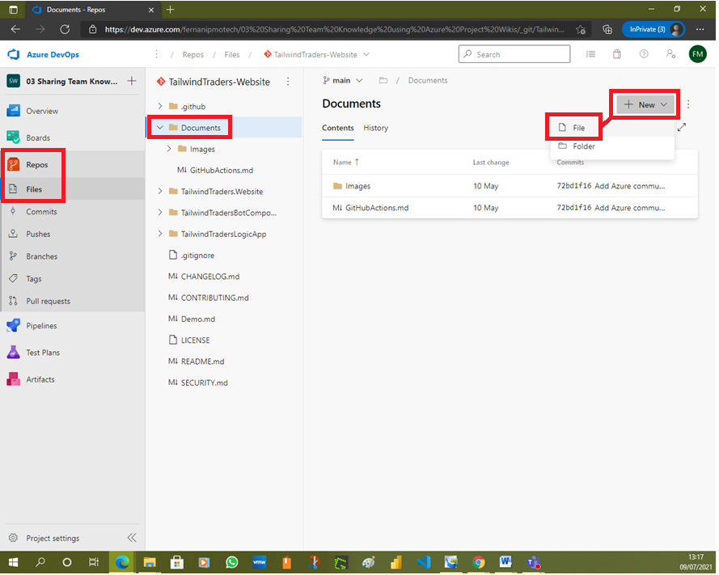
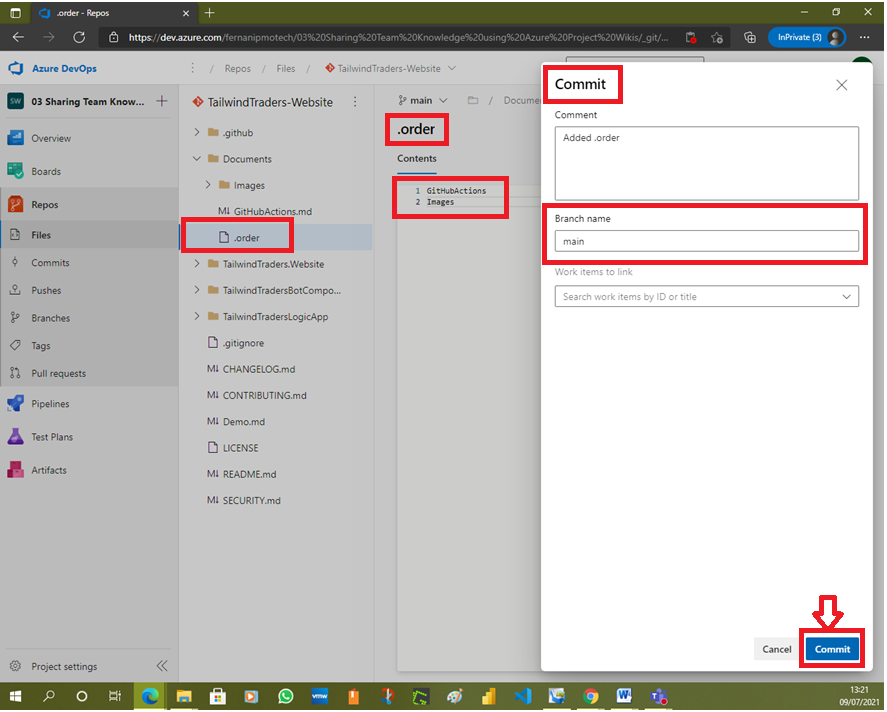

# Lab 03: Sharing Team Knowledge using Azure Project Wikis

# Student lab manual

## Lab overview

In this lab, you will create and configure wiki in an Azure DevOps, including managing markdown content and creating a Mermaid diagram.

## Objectives

After you complete this lab, you will be able to:

- Create a wiki in an Azure Project
- Add and edit markdown
- Create a Mermaid diagram

## Lab duration

- Estimated time: **45 minutes**

## Instructions

### Before you start

#### Sign in to the lab virtual machine

Ensure that you’re signed in to your Windows 10 computer by using the following credentials:

- Username: **Student**
- Password: **Pa55w.rd**

#### Review the installed applications

Find the taskbar on your Windows desktop. The taskbar contains the icons for the applications that you’ll use in this lab:

- Microsoft Edge

#### Set up an Azure DevOps organization.

If you don’t already have an Azure DevOps organization that you can use for this lab, create one by following the instructions available at [Create an organization or project collection](https://docs.microsoft.com/en-us/azure/devops/organizations/accounts/create-organization?view=azure-devops).

### Exercise 0: Configure the lab prerequisites

In this exercise, you will set up the prerequisites for the lab, which consist of the preconfigured **Tailwind Traders** team project based on an Azure DevOps Demo Generator template and a team created in Microsoft Teams.

#### Task 1: Configure the team project

In this task, you will use Azure DevOps Demo Generator to generate a new project based on the **Tailwind Traders** template.

1. On your lab computer, start a web browser and navigate to [Azure DevOps Demo Generator](https://azuredevopsdemogenerator.azurewebsites.net/). This utility site will automate the process of creating a new Azure DevOps project within your account that is prepopulated with content (work items, repos, etc.) required for the lab.

   > **Note**: For more information on the site, see https://docs.microsoft.com/en-us/azure/devops/demo-gen.

2. Click **Sign in** and sign in using the Microsoft account associated with your Azure DevOps subscription.

   

3. If required, on the **Azure DevOps Demo Generator** page, click **Accept** to accept the permission requests for accessing your Azure DevOps subscription.

4. On the **Create New Project** page, in the **New Project Name** textbox, type **Sharing Team Knowledge using Azure Project Wikis**, in the **Select organization** dropdown list, select your Azure DevOps organization, and then click **Choose template**.

   

5. In the list of templates, select the **Tailwind Traders** template and click **Select Template**.

   

6. Back on the **Create New Project** page, if prompted to install a missing extension, select the checkbox below the **ARM Outputs** and click **Create Project**.

   

   

   > **Note**: Wait for the process to complete. This should take about 2 minutes. In case the process fails, navigate to your Azure DevOps organization, delete the project, and try again.

   

7. On the **Create New Project** page, click **Navigate to project**.

   

   

### Exercise 1: Publish code as wiki

In this exercise, you will step through publishing an Azure DevOps repository as wiki and managing the published wiki.

> **Note**: Content that you maintain in a Git repository can be published to an Azure DevOps wiki. For example, content written to support a software development kit, product documentation, or README files can be published directly to a wiki. You have the option of publishing multiple wikis within the same Azure DevOps team project.

#### Task 1: Publish a branch of an Azure DevOps repo as wiki

In this task, you will publish a branch of an Azure DevOps repo as wiki.

> **Note**: If your published wiki corresponds to a product version, you can publish new branches as you release new versions of your product.

1. On you lab computer, in the Azure DevOps portal displaying the **Sharing Team Knowledge using Azure Project Wikis** project, in the vertical menu on the left side, in the **Overview** section, click **Wiki** and review the existing content.

   

2. In the vertical menu on the left side, click **Repos**, in the upper section of the **Files** pane, make sure you have the **TailwindTraders-Website** repo selected (choose it from the dropdown on the top with Git icon). In the branch dropdown list (on top of “Files” with the branch icon), select **main**, and review the content of the main branch.

   

   

   

   

   

3. To the left of the **Files** pane, in the listing of the repo folder and file hierarchy, expand the **Documents** folder and its **Images** subfolder, in the **Images** subfolder, locate the **Website.png** entry, hover with the mouse pointer over its right end to reveal the vertical ellipsis (three dots) symbol representing the **More** menu, click **More**, and, in the dropdown menu, click **Download** to download the **Website.png** file to the local **Downloads** folder on your lab computer.

   

   

   

   > **Note**: You will use this image in the next exercise of this lab.

4. In the vertical menu on the left side, click **Overview**, in the **Overview** section, select **Wiki**, in the upper section of the pane, select the **Tailwind Traders** dropdown menu header, and, in the dropdown list, select **Publish code as wiki**.

   

   

5. On the **Publish code as wiki** pane, specify the following settings and click **Publish**.

   | Setting    | Value                            |
   | :--------- | :------------------------------- |
   | Repository | **TailwindTraders-Website**      |
   | Branch     | **main**                         |
   | Folder     | **/Documents**                   |
   | Wiki name  | **Tailwind Traders (Documents)** |

   > **Note**: This will automatically display the content of the **README** file.

   

   

6. Review the content of **GitHubActions** file and note the overall structure of the wiki, matching the structure of the underlying repo.

   

   

7. In the upper section of the pane, select the **Tailwind Traders (Documents)** dropdown menu header and note that you can easily switch between this and previously published wiki.

   

   

   

   

#### Task 2: Manage content of a published wiki

In this task, you will manage content of the wiki you published in the previous task.

1. In the vertical menu on the left side, click **Repos**, ensure that the dropdown menu in the upper section of the **Files** pane displays the **TailwindTraders-Website** repo and **main** branch, in the repo folder hierarchy, select the **Documents** folder, in the upper right corner, click **+ New** and, in the dropdown menu, click **File**.

   

   

2. In the **New file** panel, in the **New file name**, after the **/Documents/** prefix, type **.order**, and click **Create**.

   

3. On the **Contents** tab of the **.order** pane, type the following and click **Commit**.

   CodeCopy

   ```text
   GitHubActions
   Images
   ```

   

4. On the **Commit** pane, click **Commit**.

   

   

5. In the vertical menu on the left side, click **Overview**, in the **Overview** section, select **Wiki**, verify that **Tailwind Traders (Documents)** appears in the upper section of the pane, and review the ordering of wiki content.

   > **Note**: The order of wiki content should match the sequence of files and folders listed in the **.order** file.

   

6. In the vertical menu on the left side, click **Repos**, ensure that the dropdown menu in the upper section of the **Files** pane displays the **TailwindTraders-Website** repo and **main** branch, in the listing of files, under **Documents**, select **GitHubActions.md**, and on the **GitHubActions.md** pane, click **Edit**.

   

7. On the **GitHubActions.md** pane, directly below the `#GitHub Actions` header, add the following markdown element referencing one of the images within the **Documents** folder:

   CodeCopy

   ```
   
   ```

   

8. On the **GitHubActions.md** pane, click **Commit** and, on the **Commit** pane, click **Commit**.

   

9. On the **Preview** tab of the **GitHubActions.md** pane, verify that the image is being displayed.

10. In the vertical menu on the left side, click **Overview**, in the **Overview** section, select **Wiki**, verify that **Tailwind Traders (Documents)** appears in the upper section of the pane, and that the content of the **GitHubActions** pane includes the newly referenced image.

    

### Exercise 2: Create and manage a project wiki

In this exercise, you will step through creating and managing a project wiki.

> **Note**: You can create and manage wiki independently of the existing repos.

#### Task 1: Create a project wiki including a Mermaid diagram and an image

In this task, you will create a project wiki and add to it a Mermaid diagram and an image.

1. On your lab computer, in the Azure DevOps portal displaying the Wiki pane of the **Sharing Team Knowledge using Azure Project Wikis** project, with the content of the **Tailwind Traders (Documents)** wiki selected, at the top of the pane, click the **Tailwind Traders (Documents)** dropdown list header, and, in the drop down list, select **Create new project wiki**.

   

2. In the **Page title** text box, type **Project Design**.

   

   

3. Place the cursor in the body of the page, click the left-most icon in the toolbar representing the header setting and, in the dropdown list, click **Header 1**. This will automatically add the hash character (**#**) at the beginning of the line.

   

   

4. Directly after the newly added **#** character, type **Authentication and Authorization** and press the **Enter** key.

   

   

5. Click the left-most icon in the toolbar representing the header setting and, in the dropdown list, click **Header 2**. This will automatically add the hash character (**##**) at the beginning of the line.

   

6. Directly after the newly added **##** character, type **Azure DevOps OAuth 2.0 Authorization Flow** and press the **Enter** key.

   

7. **Copy and paste** the following code to insert a mermaid diagram on your wiki.

   CodeCopy

   ```
   ::: mermaid
   sequenceDiagram
    participant U as User
    participant A as Your app
    participant D as Azure DevOps
    U->>A: Use your app
    A->>D: Request authorization for user
    D-->>U: Request authorization
    U->>D: Grant authorization
    D-->>A: Send authorization code
    A->>D: Get access token
    D-->>A: Send access token
    A->>D: Call REST API with access token
    D-->>A: Respond to REST API
    A-->>U: Relay REST API response
   :::
   ```

   > **Note**: For details regarding the Mermaid syntax, refer to [About Mermaid](https://mermaid-js.github.io/mermaid/#/)

8. To the right of the editor pane, in the preview pane, click **Load diagram** and review the outcome.

   

   > **Note**: The output should resemble the flowchart that illustrates how to [Authorize access to REST APIs with OAuth 2.0](https://docs.microsoft.com/en-us/azure/devops/integrate/get-started/authentication/oauth?view=azure-devops)

   

9. In the upper right corner of the editor pane, click the down-facing caret next to the **Save** button and, in the dropdown menu, click **Save with revision message**.

   

10. In the **Save page** dialog box, type **Authentication and authorization section with the OAuth 2.0 Mermaid diagram** and click **Save**.

    

    

11. On the **Project Design** editor pane, place the cursor at the end of the Mermaid element you added earlier in this task, press the **Enter** key to add an extra line, click the left-most icon in the toolbar representing the header setting and, in the dropdown list, click **Header 2**. This will automatically add the double hash character (**##**) at the beginning of the line.

    

12. Directly after the newly added **##** character, type **User Interface** and press the **Enter** key.

    

13. On the **Project Design** editor pane, in the toolbar, click the paper clip icon representing the **Insert a file** action, in the **Open** dialog box, navigate to the **Downloads** folder, select the **Website.png** file you downloaded in the previous exercise, and click **Open**.

    

    

14. Back on the **Project Design** editor pane, review the preview pane and verify that the image is properly displayed.

    

15. In the upper right corner of the editor pane, click the down-facing caret next to the **Save** button and, in the dropdown menu, click **Save with revision message**.

    

16. In the **Save page** dialog box, type **User Interface section with the Tailwind Traders image** and click **Save**.

    

    

17. Back on the editor pane, in the upper right corner, click **Close**.

    

#### Task 2: Manage a project wiki

In this task, you will manage the newly created project wiki.

> **Note**: You will start by reverting the most recent change to the wiki page.

1. On you lab computer, in the Azure DevOps portal displaying the Wiki pane of the **Sharing Team Knowledge using Azure Project Wikis** project, with the content of the **Project Design** wiki selected, in the upper right corner, click the vertical ellipsis symbol and, in the dropdown menu, click **View revisions**.

   

2. On the **Revisions** pane, click the entry representing the most recent change.

   

   

3. On the resulting pane, review the comparison between the previous and the current version of the document, click **Revert**, when prompted for the confirmation, click **Revert** again, and then click **Browse Page**.

   

   

   

4. Back on the **Project Design** pane, verify that the change was successfully reverted.

   > **Note**: Now you will add another page to the project wiki and set it as the wiki home page.

5. On the **Project Design** pane, at the bottom left corner, click **+ New page**.

   

6. On the page editor pane, in the **Page title** text box, type **Project Design Overview**, click **Save**, and then click **Close**.

   

   

   

7. Back in the pane listing the pages within the **Project Design** project wiki, locate the **Project Design Overview** entry, select it with the mouse pointer, drag and drop it above the **Project Design** page entry.

   

8. Verify that the **Project Design Overview** entry is listed as the top level page with the home icon designating it as the wiki home page.

   

## Review

In this lab, you created and configured Wiki in an Azure DevOps, including managing markdown content and creating a Mermaid diagram.