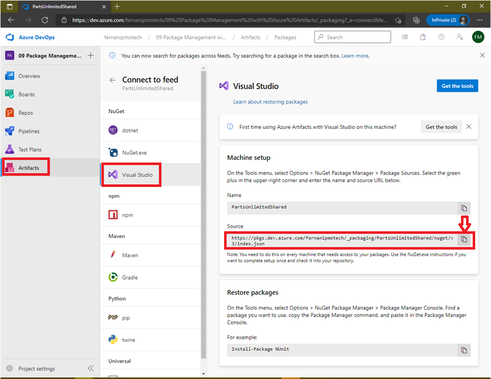
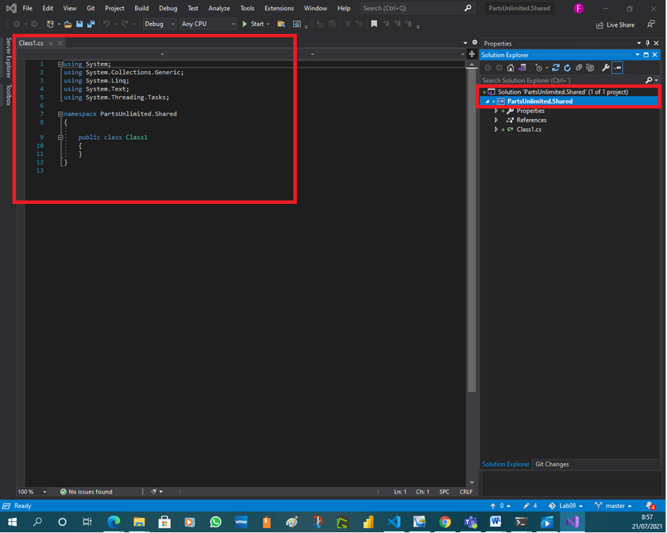
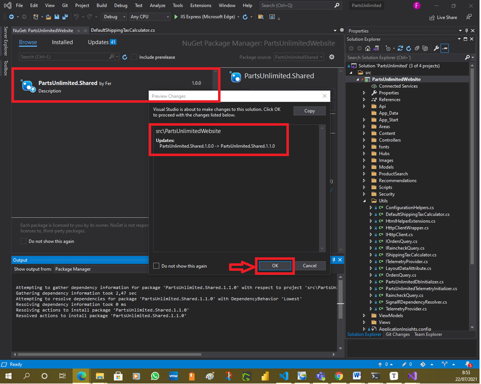
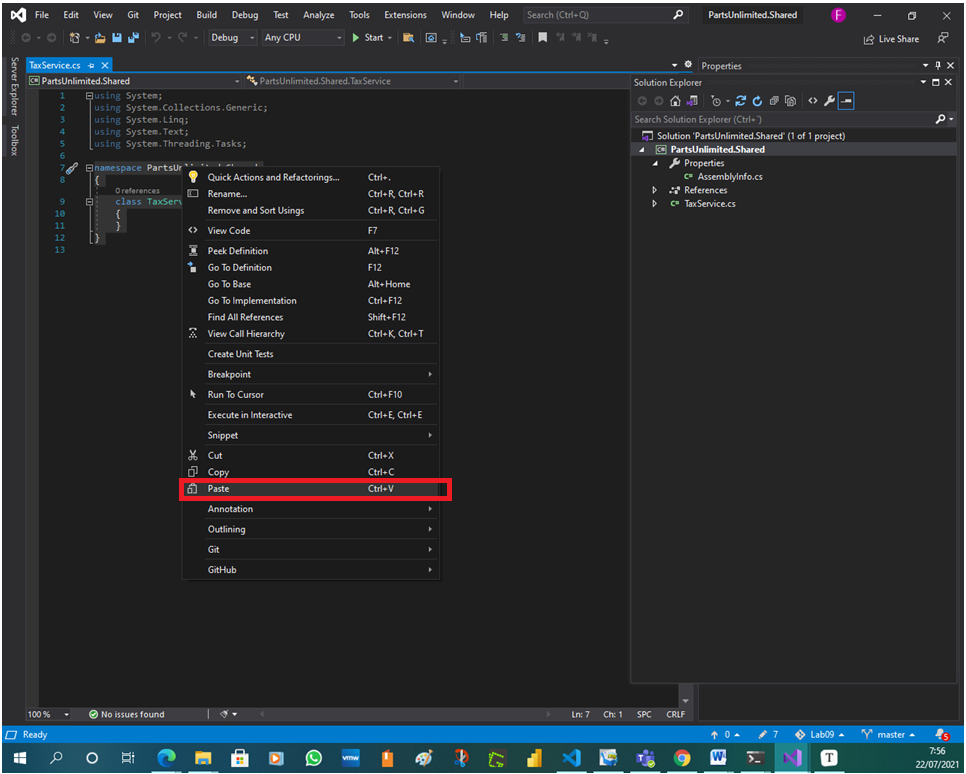
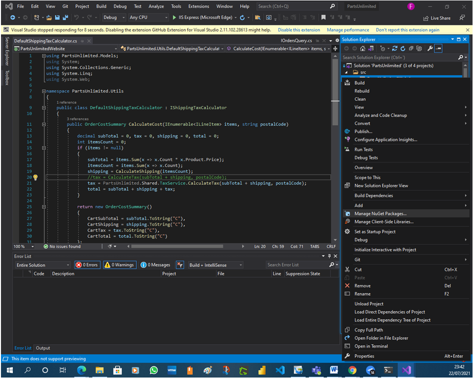
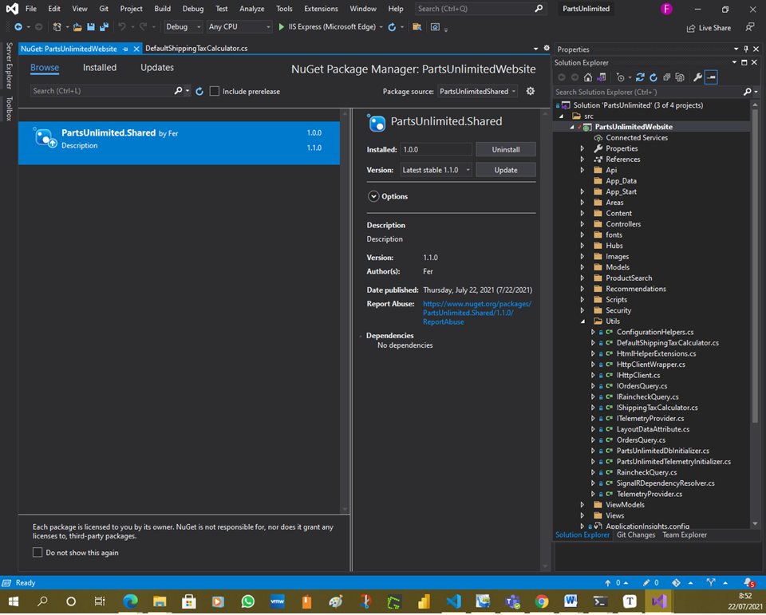
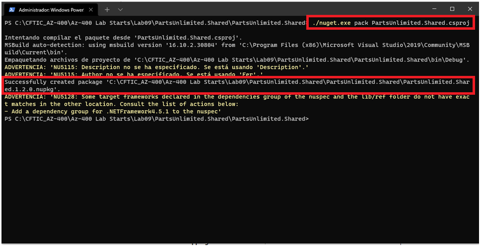
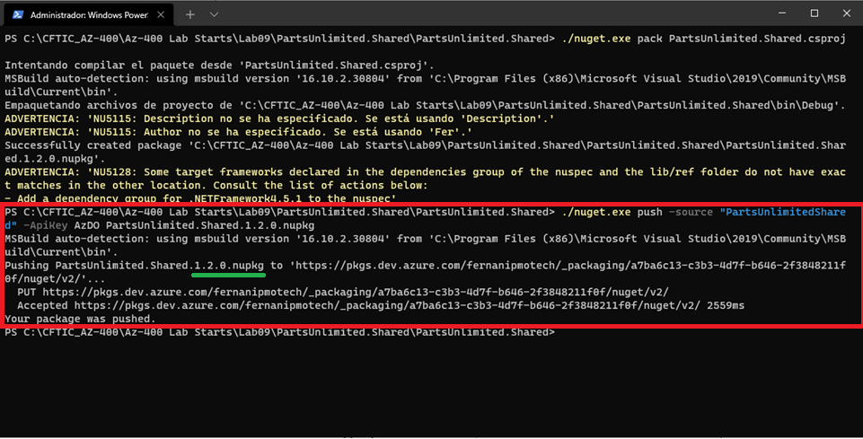
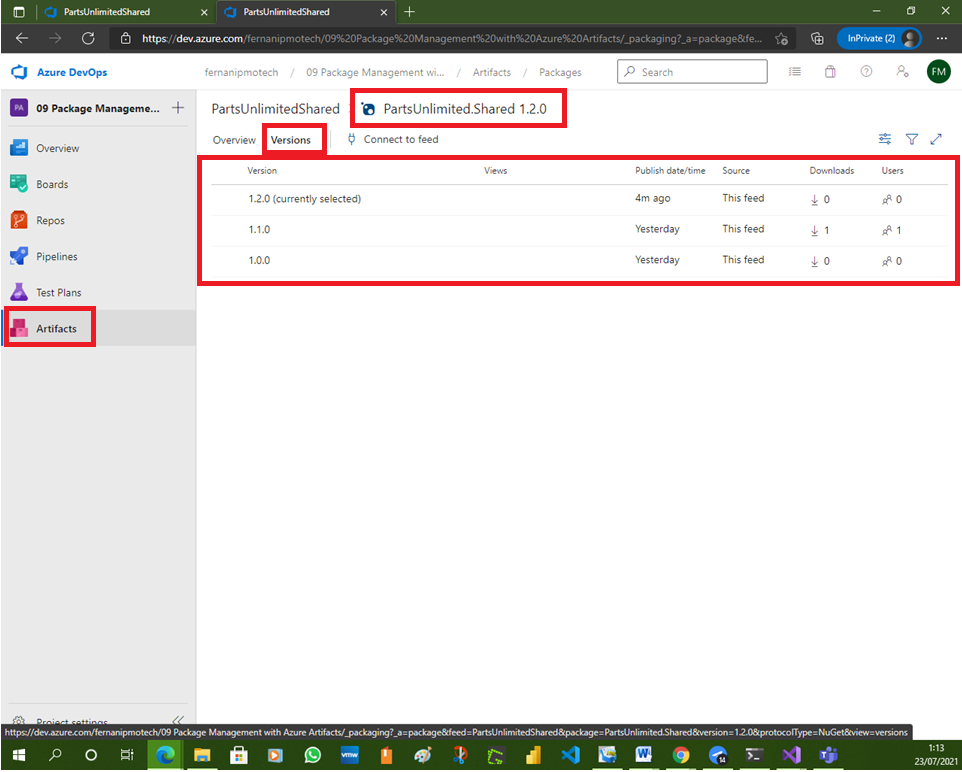
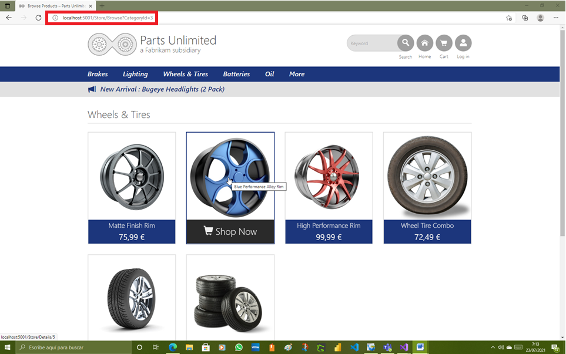

# Lab 09: Package Management with Azure Artifacts

# Student lab manual

## Lab overview

Azure Artifacts facilitate discovery, installation, and publishing NuGet, npm, and Maven packages in Azure DevOps. It’s deeply integrated with other Azure DevOps features such as Build, making package management a seamless part of your existing workflows.

## Objectives

After you complete this lab, you will be able to:

- Create and connect to a feed.
- Create and publish a NuGet package.
- Import a NuGet package.
- Update a NuGet package.

## Lab duration

- Estimated time: **40 minutes**

## Instructions

### Before you start

#### Sign in to the lab virtual machine

Ensure that you’re signed in to your Windows 10 virtual machine by using the following credentials:

- Username: **Student**
- Password: **Pa55w.rd**

#### Review applications required for this lab

Identify the applications that you’ll use in this lab:

- Microsoft Edge
- Visual Studio 2019 Community Edition available from [Visual Studio Downloads page](https://visualstudio.microsoft.com/downloads/). Visual Studio 2019 installation should include **ASP.NET and web development**, **Azure development**, and **.NET Core cross-platform development** workloads. This is already preinstalled on your lab computer.

#### Set up an Azure DevOps organization

If you don’t already have an Azure DevOps organization that you can use for this lab, create one by following the instructions available at [Create an organization or project collection](https://docs.microsoft.com/en-us/azure/devops/organizations/accounts/create-organization?view=azure-devops).

### Exercise 0: Configure the lab prerequisites

In this exercise, you will set up the prerequisites for the lab, which include the preconfigured Parts Unlimited team project based on an Azure DevOps Demo Generator template and a Visual Studio configuration.

#### Task 1: Configure the team project

In this task, you will use Azure DevOps Demo Generator to generate a new project based on the **PartsUnlimited** template.

1. On your lab computer, start a web browser and navigate to [Azure DevOps Demo Generator](https://azuredevopsdemogenerator.azurewebsites.net/). This utility site will automate the process of creating a new Azure DevOps project within your account that is prepopulated with content (work items, repos, etc.) required for the lab.

   > **Note**: For more information on the site, see https://docs.microsoft.com/en-us/azure/devops/demo-gen.

2. Click **Sign in** and sign in using the Microsoft account associated with your Azure DevOps subscription.

   

3. If required, on the **Azure DevOps Demo Generator** page, click **Accept** to accept the permission requests for accessing your Azure DevOps subscription.

4. On the **Create New Project** page, in the **New Project Name** textbox, type **Package Management with Azure Artifacts**, in the **Select organization** dropdown list, select your Azure DevOps organization, and then click **Choose template**.

   

5. On the **Choose a template** page, in the list of templates, click the **PartsUnlimited** template, and then click **Select Template**.

   

6. Back on the **Create New Project** page, click **Create Project**

   

   > **Note**: Wait for the process to complete. This should take about 2 minutes. In case the process fails, navigate to your DevOps organization, delete the project, and try again.

   

   

7. On the **Create New Project** page, click **Navigate to project**.

   

#### Task 2: Configuring the Parts Unlimited solution in Visual Studio

In this task, you will configure Visual Studio to prepare for the lab.

1. Ensure that you are viewing the **Package Management with Azure Artifacts** team project on the Azure DevOps portal.

   

   > **Note**: You can access the project page directly by navigating to the [https://dev.azure.com/``/Package%20Management%20with%20Azure%20Artifacts](https://dev.azure.com/``/Package Management with Azure Artifacts) URL, where the `<your-Azure-DevOps-account-name>` placeholder, represents your account name.

2. In the vertical menu on the left side of the **Package Management with Azure Artifacts** pane, click **Repos**.

   

3. On the **Files** pane, click **Clone**, click **Clone in VS Code**, and, in the dropdown menu, select **Visual Studio**.

   

4. If prompted whether to proceed, click **Open**.

   

5. If prompted, sign in with the user account you used to set up your Azure DevOps organization.

   

   

   

   Due to the error, I make this task manually, cloning the repository by the Visual Studio initial task :

   

   Copying the repository address in Azure DevOps - Repos - Files - Clone Repository

   

6. Within the Visual Studio interface, in the **Azure DevOps** pop-up window, accept the default local path and click **Clone**. This will automatically import the project into Visual Studio and open a new web browser tab displaying the Migration Report page.

   

   

   

   

   

   

   > **Note**: In the **Review Project and Solution Changes** dialog box, review the warnings about unsupported project types and click **OK**.

   I modified the language settings and changed it to English.

   

7. Close the web browser tab displaying the Migration Report page.

8. Leave Visual Studio window open for use in your lab.

### Exercise 1: Working with Azure Artifacts

In this exercise, you will learn how to work with Azure Artifacts by using the following steps:

- create and connect to a feed.
- create and publish a NuGet package.
- import a NuGet package.
- update a NuGet package.

#### Task 1: Creating and connecting to a feed

In this task, you will create and connect to a feed.

1. In the web browser window displaying your project settings in the Azure DevOps portal, in the vertical navigational pane, select **Artifacts**.

   

2. With the **Artifacts** hub displayed, click **+ Create feed** at the top of the pane.

   > **Note**: This feed will be a collection of NuGet packages available to users within the organization and will sit alongside the public NuGet feed as a peer. The scenario in this lab will focus on the workflow for using Azure Artifacts, so the actual architectural and development decisions are purely illustrative. This feed will include common functionality that can be shared across projects in this organization.

   

3. On the **Create new feed** pane, in the **Name** textbox, type **PartsUnlimitedShared**, in the **Scope** section, select the **Organization** option, leave other settings with their default values, and click **Create**.

   > **Note**: Any user who wants to connect to this NuGet feed must configure their environment.

   

4. Back on the **Artifacts** hub, click **Connect to feed**.

5. On the **Connect to feed** pane, in the **NuGet** section, select **Visual Studio** and, on the **Visual Studio** pane, copy the **Source** url.

   

   

6. Switch back to the **Visual Studio** window.

7. In the Visual Studio window, click **Tools** menu header, in the dropdown menu, select **NuGet Package Manager** and, in the cascading menu, select **Package Manager Settings**.

8. In the **Options** dialog box, click **Package Sources** and click the plus sign to add a new package source.

9. At the bottom of the dialog box, in the **Name** textbox, replace **Package source** with **PartsUnlimitedShared** and, in the **Source** textbox, paste the URL you copied in the Azure DevOps portal.

10. Click **Update** and then click **OK** to finalize the addition.

    > **Note**: Visual Studio is now connected to the new feed.

    

11. Close and reopen the other Visual Studio instance you used for cloning the PartsUnlimited repository, to account for the artifact source update and open the **PartsUnlimited** solution. You will need it in the third task of this exercise.

    

#### Task 2: Creating and publishing a NuGet package

In this task, you will create and publish a NuGet package.

1. In the Visual Studio window you used to configure the new package source, in the main menu, click **File**, in the dropdown menu, click **New** and then, in the cascading menu, click **Project**.

   

   

   > **Note**: We will now create a shared assembly that will be published as a NuGet package so that other teams can integrate it and stay up to date without having to work directly with the project source.

2. On the **Recent project templates** page of the **Create a new project** pane, use the search textbox to locate the **Class Library (.NET Framework)** template, select it, and click **Next**.

   

3. On the **Class Library (.NET Framework)** page of the **Create a new project** pane, specify the following settings and click **Create**:

   | Setting       | Value                     |
   | :------------ | :------------------------ |
   | Project name  | **PartsUnlimited.Shared** |
   | Location      | accept the default value  |
   | Solution      | **Create new solution**   |
   | Solution name | **PartsUnlimited.Shared** |
   | Framework     | **.NET Framework 4.5.1**  |

   > **Note**: Make sure not to select **.NET Standard**.

   

   

4. Within the Visual Studio interface, in the **Solution Explorer** pane, right-click **Class1.cs**, in the right-click menu, select **Delete**, and, when prompted for confirmation, click **OK**.

   

   

   

   

5. Within the Visual Studio interface, in the **Solution Explorer** pane, right-click the **PartsUnlimited.Shared** project node and select **Properties**.

   

6. Within the **PartsUnlimited.Shared** properties pane, verify that the **Target framework** is set to **.NET Framework 4.5.1**.

   

7. Press **Ctrl+Shift+B** to build the project.

   > **Note**: In the next task we’ll use **NuGet.exe** to generate a NuGet package directly from the built project, but it requires the project to be built first.

   

   

8. Switch to the web browser displaying the Azure DevOps portal.

9. Navigate to the **Connect to feed** pane, in the **NuGet** section and select **NuGet.exe**. This will display the **NuGet.exe** pane.

10. On the **NuGet.exe** pane, click **Get the tools**.

    

11. On the **Get the tools** pane, click the **Download the latest NuGet** link. This will automatically open another browser tab displaying the **Available NuGet Distribution Versions** page.

    

12. On the **Available NuGet Distribution Versions** page, select nuget.exe version **v5.5.1** and download the executable to the local **Downloads** folder.

    

    

13. Switch to the **Visual Studio** window. In the **Solution Explorer** pane, right-click the **PartsUnlimited.Shared** project node and, in the right-click menu, select **Open Folder in File Explorer**.

    

14. Within the File Explorer window, move the downloaded **nuget.exe** file from the **Downloads** folder into the folder containing the **.csproj** file.

    

    

15. In the same File Explorer window, select the **File** menu header, in the dropdown menu, select **Open Windows PowerShell**, and, in the cascading menu, click **Open Windows PowerShell as administrator**.

    

16. In the **Administrator: Windows PowerShell** window, run the following to create a **.nupkg** file from the project.

    

    > **Note**: This is a shortcut to package the NuGet bits for deployment. NuGet is highly customizable. To learn more, refer to the [NuGet package creation page](https://docs.microsoft.com/en-us/nuget/create-packages/overview-and-workflowhttps:/docs.microsoft.com/en-us/nuget/create-packages/overview-and-workflow).

    CodeCopy

    ```
    ./nuget.exe pack ./PartsUnlimited.Shared.csproj
    ```

    > **Note**: Disregard any warnings displayed in the **Administrator: Windows PowerShell** window.

    > **Note**: NuGet builds a minimal package based on the information it is able to identify from the project. For example, note that the name is **PartsUnlimited.Shared.1.0.0.nupkg**. That version number was retrieved from the assembly.

    

17. Switch back to the **Visual Studio** window, in the **Solution Explorer** pane, expand the **PartsUnlimited.Shared\Properties** node, click **AssemblyInfo.cs** to open it in the central pane of the window, and review its content.

    > **Note**: The **AssemblyVersion** attribute specifies the version number to build into the assembly. Each NuGet release requires a unique version number, so if we continue to use this method for creating packages, we need to increment this before the build.

    

18. Switch to the **Administrator: Windows PowerShell** window and run the following to publish the package to the **PartsUnlimitedShared** feed:

    > **Note**: You need to provide an **API Key**, which can be any non-empty string. We’re using **AzDO** here. When prompted, sign in to your Azure DevOps organization.

    CodeCopy

    ```
    ./nuget.exe push -source "PartsUnlimitedShared" -ApiKey AzDO PartsUnlimited.Shared.1.0.0.nupkg
    ```

    

    

19. Switch to the web browser window displaying the Azure DevOps portal and, in the vertical navigational pane, select **Artifacts**.

    

20. On the **Artifacts** hub pane, click the dropdown list in the upper left corner and, in the list of feeds, select the **PartsUnlimitedShared** entry.

    > **Note**: The **PartsUnlimitedShared** feed should include the newly published NuGet package.

21. Click the NuGet package to display its details.

    

#### Task 3: Importing a NuGet package

In this task, you will import a NuGet package.

1. Switch to the **Visual Studio** window displaying the **Parts Unlimited** solution.

2. In the **Solution Explorer** pane, right-click the **References** node under the **PartsUnlimitedWebsite** project and, in the right-click menu, select **Manage NuGet Packages**. This will open the **NuGet: PartsUnlimitedWebsite** tab in the central pane of the window.

   

3. In the **NuGet: PartsUnlimitedWebsite** pane, click the **Browse** tab and, in the **Package source** drop-down list in the upper right corner of the pane, select **PartsUnlimitedShared**.

   

   

   > **Note**: The list of packages will consist only of the single package you just added.

4. Select the package and, in the **PartsUnlimited.Shared** pane, click **Install** to add it to the project.

   

5. When prompted, in the **Preview Changes** dialog box, click **OK**.

   

6. Press **Ctrl+Shift+B** to build the project and verify that the build completed successfully.

   

   > **Note**: The NuGet package doesn’t add any value yet, but we managed to verify that the workflow works as intended.

#### Task 4: Updating a NuGet package

In this task, you will update a NuGet package.

1. Switch to the **Visual Studio** window that has the **PartsUnlimited.Shared** project open (containing the NuGet source project).

2. In the **Solution Explorer** pane, right-click the **PartsUnlimited.Shared** project node, in the right-click menu, select **Add** and, in the cascading menu, select **New Item**.

3. In the **Add New Item - PartsUnlimitedShared** dialog box, in the list of **Visual C# items**, ensure that the **Class** template is selected, in the **Name** textbox at the bottom of the dialog box, type **“TaxService.cs”**, and click **Add** to add the class.

   

   

   > **Note**: We will pretend that tax calculation will be consolidated into this shared class and managed centrally so that other teams can simply work with the NuGet package.

4. In the central pane, in the code of the **TaxService.cs** class, replace the existing definition of the class with the following code and save the file:

   CodeCopy

   ```c#
   namespace PartsUnlimited.Shared
   {
       public class TaxService
       {
           static public decimal CalculateTax(decimal taxable, string postalCode)
           {
               return taxable * (decimal).1;
           }
       }
   }
   ```

   > **Note**: Since we’re updating the assembly (and package), we need to update the assembly version.

   

   

   

   

5. In the Visual Studio window, in the central pane, click the **AssemblyInfo.cs** tab to display the content of the corresponding file.

   

6. In the **AssemblyInfo.cs** file, change the `[assembly: AssemblyVersion("1.0.0.0")]` to `[assembly: AssemblyVersion("1.1.0.0")]` and save the file.

   

7. Press **Ctrl+Shift+B** to build the project.

   

   

8. Switch to the **Administrator: Windows PowerShell** window and run the following command to repackage the NuGet package.

   > **Note**: The new package will have the updated version number.

   CodeCopy

   ```
   ./nuget.exe pack PartsUnlimited.Shared.csproj
   ```

   

9. From the **Administrator: Windows PowerShell** window, run the following command to publish the updated package.

   

   

   

   

   

   

   

   > **Note**: The published artifact version number is changed to reflect the package version update.

   CodeCopy

   ```
   ./nuget.exe push -source "PartsUnlimitedShared" -ApiKey AzDO PartsUnlimited.Shared.1.1.0.nupkg
   ```

   

   

   

   

10. Switch to the web browser window displaying the Azure DevOps portal with the **PartsUnlimitedShared 1.0.0** artifact pane.

    

11. On the **PartsUnlimitedShared 1.0.0** artifact pane, click the **Versions** tab and verify that it includes versions **1.0.0** and **1.1.0**.

    

    

12. Switch back to the **Visual Studio** window displaying the **PartsUnlimited** project.

    

13. In the **Solution Explorer** pane, navigate to and select **PartsUnlimitedWebsite\Utils\DefaultShippingTaxCalculator.cs**. This will automatically open the file in the central pane of the window.

    

    

14. In the code of the **DefaultShippingTaxCalculator.cs** file, locate the call to **CalculateTax** on line **20** and replace `tax = CalculateTax(subTotal + shipping, postalCode);` with `tax = PartsUnlimited.Shared.TaxService.CalculateTax(subTotal + shipping, postalCode);`

    

    

    

    

    > **Note**: The original code called a method internal to this class, so the code we’re adding to the beginning of the line is redirecting it to code from our NuGet assembly. However, since this project hasn’t updated the NuGet package yet, it’s still referencing 1.0.0.0 and doesn’t have these new changes available, so the code will not build properly.

15. In the **Solution Explorer** pane, right-click the **References** node and, in the right-click menu, select **Manage NuGet Packages**.

    

    > **Note**: NuGet is aware of our update, as indicated by the content of the **Updates** tab.

16. In the **NuGet: PartsUnlimitedWebsite** pane, click the **Updates** tab, in the search textbox, type **PartsUnlimited.Shared** and, on the right-hand side of the pane, next to the **Version: Latest stable 1.1.0** dropdown list, click **Update** to install the new version.

    

    

    

    

    

    After these settings changes, restart Visual Studio.

    

    

    

    

    

    

    Updating a **NuGet Package** to version **1.2.0**

    Changing tax value 1 to 0.21 in **TaxService.cs**

    

    Changing **AssemblyVersión** to **1.2.0.0**

    

    

    

    

    

    

    

    

    

    

    

    

    

    > **Note**: There may be many NuGet updates available, but you should only need to update **PartsUnlimited.Shared**. Note that it may take a little while for the package to become completely available for updating. If you get an error, wait a moment and try again.

17. When prompted, in the **Preview Changes** dialog box, click **OK**.

    

18. Press the **F5** key to build and run the site. Verify that it works as expected.

    

    

    

    

    

    

    

    

    

#### Review

In this lab, you learned how to work with Azure Artifacts by using the following steps:

- created and connect to a feed.
- created and publish a NuGet package.
- imported a NuGet package.
- updated a NuGet package.