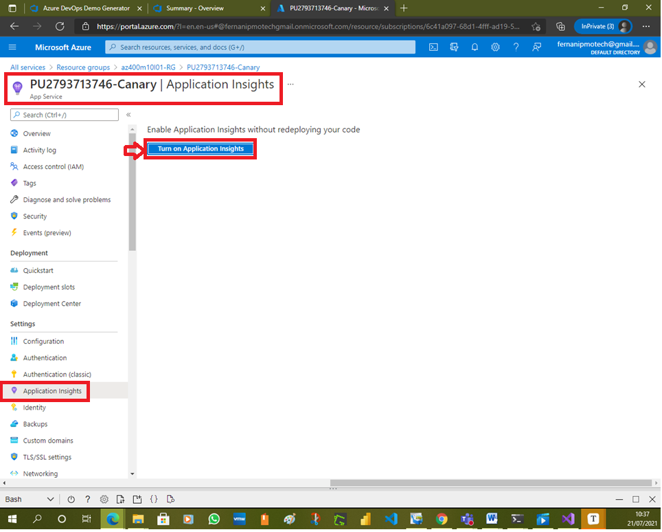
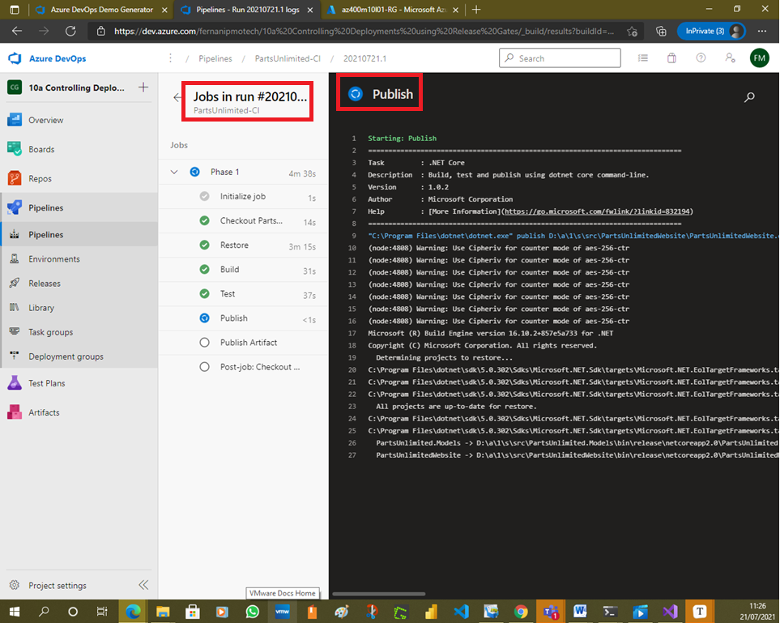
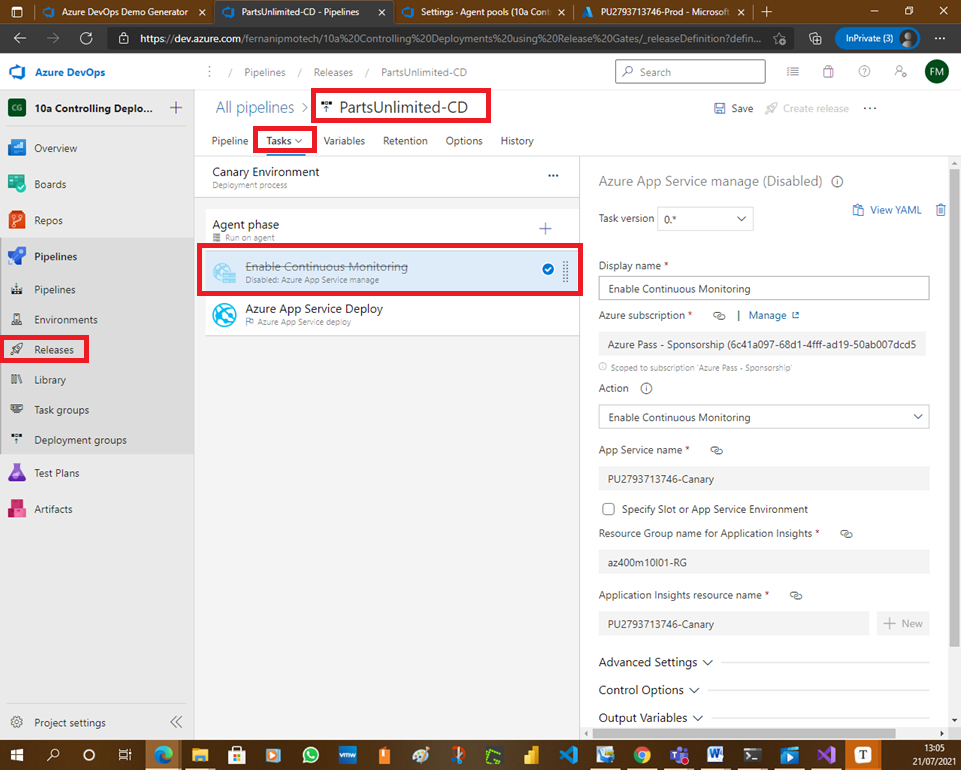
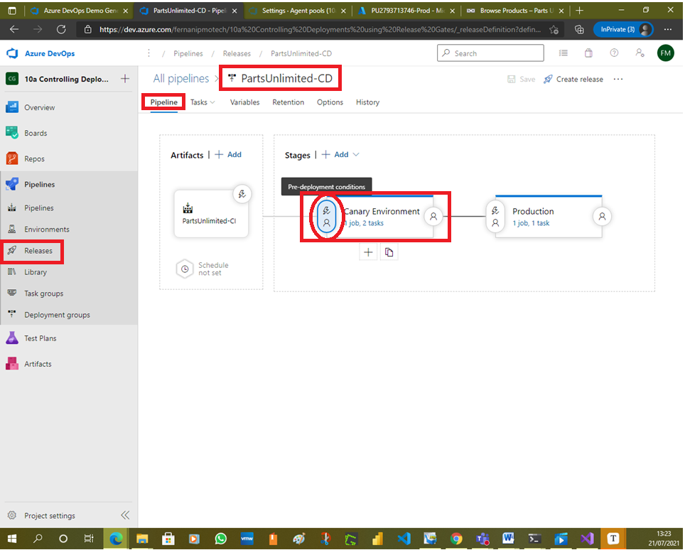
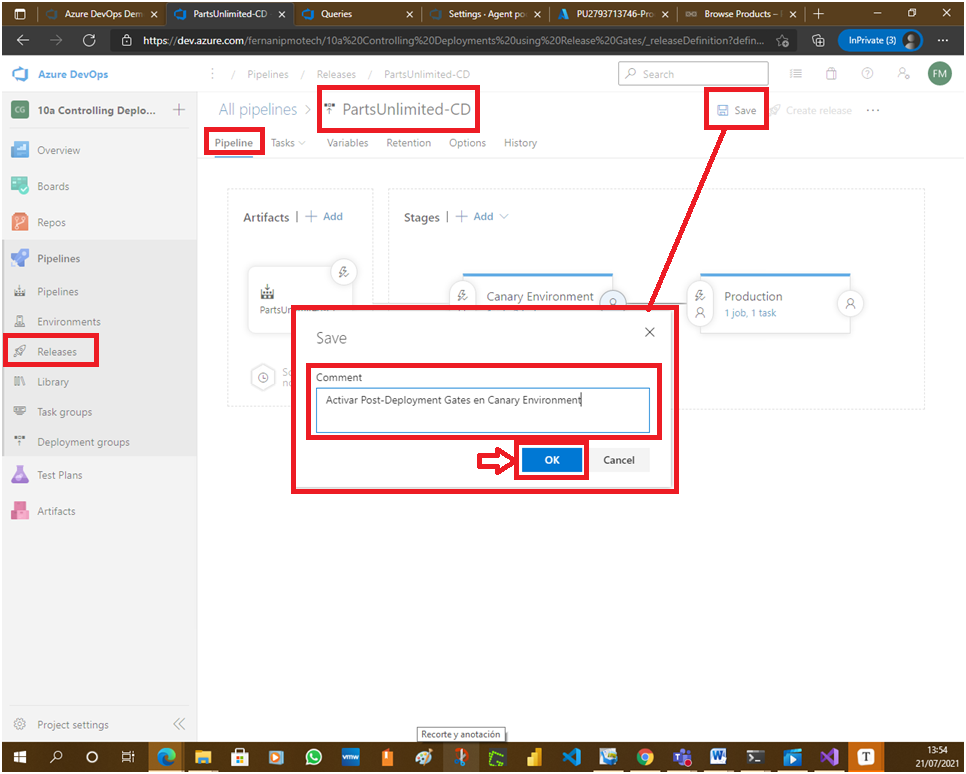
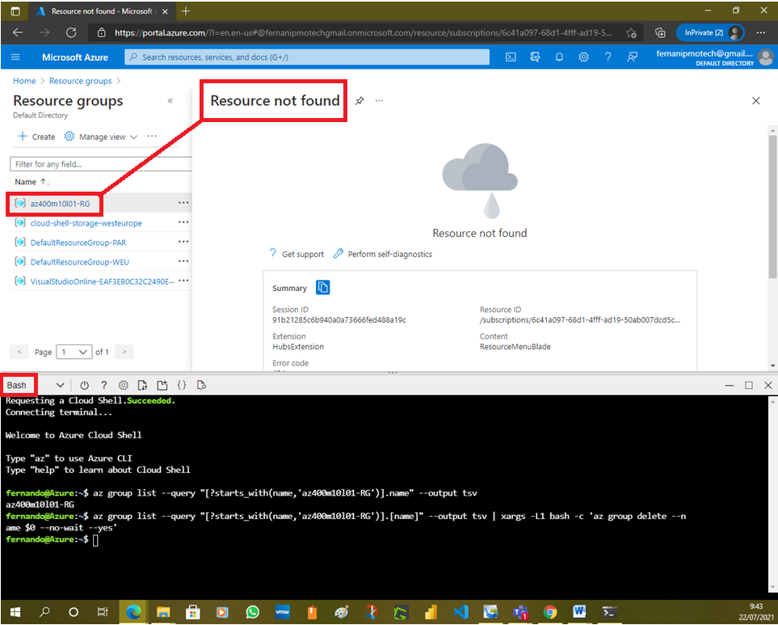

# Lab 10a: Controlling Deployments using Release Gates

# Student lab manual

## Lab overview

This lab covers the configuration of the deployment gates and details how to use them to control execution of Azure pipelines. To illustrate their implementation, you will configure a release definition with two environments for an Azure Web App. You will deploy to the Canary environment only when there are no blocking bugs for the app and mark the Canary environment complete only when there are no active alerts in Application Insights of Azure Monitor.

A release pipeline specifies the end-to-end release process for an application to be deployed across a range of environments. Deployments to each environment are fully automated by using jobs and tasks. Ideally, you do not want new updates to the applications to be exposed to all the users at the same time. It is a best practice to expose updates in a phased manner i.e. expose to a subset of users, monitor their usage and expose to other users based on the experience of the initial set of users.

Approvals and gates enable you to take control over the start and completion of the deployments in a release. With approvals, you can wait for users to manually approve or reject deployments. Using release gates, you can specify application health criteria that must be met before release is promoted to the next environment. Prior to or after any environment deployment, all the specified gates are automatically evaluated until they all pass or until they reach your defined timeout period and fail.

Gates can be added to an environment in the release definition from the pre-deployment conditions or the post-deployment conditions panel. Multiple gates can be added to the environment conditions to ensure all the inputs are successful for the release.

As an example:

- Pre-deployment gates ensure there are no active issues in the work item or problem management system before deploying a build to an environment.
- Post-deployment gates ensure there are no incidents from the monitoring or incident management system for the app after it’s been deployed, before promoting the release to the next environment.

There are 4 types of gates included by default in every account.

- Invoke Azure Function: Triggers execution of an Azure Function and ensures a successful completion.
- Query Azure Monitor alerts: Observes the configured Azure Monitor alert rules for active alerts.
- Invoke REST API: Makes a call to a REST API and continues if it returns a successful response.
- Query work items: Ensures the number of matching work items returned from a query is within a threshold.

## Objectives

After you complete this lab, you will be able to:

- Configure release pipelines
- Configure release gates
- Test release gates

## Lab duration

- Estimated time: **75 minutes**

## Instructions

### Before you start

#### Sign in to the lab virtual machine

Ensure that you’re signed in to your Windows 10 virtual machine by using the following credentials:

- Username: **Student**
- Password: **Pa55w.rd**

#### Review applications required for this lab

Identify the applications that you’ll use in this lab:

- Microsoft Edge

#### Set up an Azure DevOps organization.

If you don’t already have an Azure DevOps organization that you can use for this lab, create one by following the instructions available at [Create an organization or project collection](https://docs.microsoft.com/en-us/azure/devops/organizations/accounts/create-organization?view=azure-devops).

#### Prepare an Azure subscription

- Identify an existing Azure subscription or create a new one.
- Verify that you have a Microsoft account or an Azure AD account with the Owner role in the Azure subscription and the Global Administrator role in the Azure AD tenant associated with the Azure subscription. For details, refer to [List Azure role assignments using the Azure portal](https://docs.microsoft.com/en-us/azure/role-based-access-control/role-assignments-list-portal) and [View and assign administrator roles in Azure Active Directory](https://docs.microsoft.com/en-us/azure/active-directory/roles/manage-roles-portal#view-my-roles).

### Exercise 0: Configure the lab prerequisites

In this exercise, you will set up the prerequisites for the lab, which include the preconfigured Parts Unlimited team project based on an Azure DevOps Demo Generator template and two Azure web apps representing the **Canary** and **Production** environments, into which you’ll deploy the application via Azure Pipelines.

#### Task 1: Configure the team project

In this task, you will use Azure DevOps Demo Generator to generate a new project based on the **ReleaseGates** template.

1. On your lab computer, start a web browser and navigate to [Azure DevOps Demo Generator](https://azuredevopsdemogenerator.azurewebsites.net/). This utility site will automate the process of creating a new Azure DevOps project within your account that is prepopulated with content (work items, repos, etc.) required for the lab.

   > **Note**: For more information on the site, see https://docs.microsoft.com/en-us/azure/devops/demo-gen.

2. Click **Sign in** and sign in using the Microsoft account associated with your Azure DevOps subscription.

   

3. If required, on the **Azure DevOps Demo Generator** page, click **Accept** to accept the permission requests for accessing your Azure DevOps subscription.

4. On the **Create New Project** page, in the **New Project Name** textbox, type **Controlling Deployments using Release Gates**, in the **Select organization** dropdown list, select your Azure DevOps organization, and then click **Choose template**.

   

5. In the list of templates, in the toolbar, click **DevOps Labs**, select the **ReleaseGates** template and click **Select Template**.

   

6. Back on the **Create New Project** page, click **Create Project**

   

   

   > **Note**: Wait for the process to complete. This should take about 2 minutes. In case the process fails, navigate to your DevOps organization, delete the project, and try again.

   

7. On the **Create New Project** page, click **Navigate to project**.

   

   

   

#### Task 2: Create two Azure web apps

In this task, you will create two Azure web apps representing the **Canary** and **Production** environments, into which you’ll deploy the application via Azure Pipelines.

1. From the lab computer, start a web browser, navigate to the [**Azure Portal**](https://portal.azure.com/), and sign in with the user account that has the Owner role in the Azure subscription you will be using in this lab and has the role of the Global Administrator in the Azure AD tenant associated with this subscription.

   

   

   

2. In the Azure portal, click the **Cloud Shell** icon, located directly to the right of the search textbox at the top of the page.

3. If prompted to select either **Bash** or **PowerShell**, select **Bash**.

   > **Note**: If this is the first time you are starting **Cloud Shell** and you are presented with the **You have no storage mounted** message, select the subscription you are using in this lab, and select **Create storage**.

4. From the **Bash** prompt, in the **Cloud Shell** pane, run the following command to create a resource group (replace the `<region>` placeholder with the name of the Azure region that will host the two Azure web apps, for example ‘westeurope’ or ‘eastus’):

   > **Note**: possible locations can be found by running the following command, use the **Name** on `<region>` : `az account list-locations -o table`

   

   

   CodeCopy

   ```bash
   RESOURCEGROUPNAME='az400m10l01-RG'
   az group create -n $RESOURCEGROUPNAME -l '<region>'
   ```

   

5. To create an App service plan

   CodeCopy

   ```bash
   SERVICEPLANNAME='az400m01l01-sp1'
   az appservice plan create -g $RESOURCEGROUPNAME -n $SERVICEPLANNAME --sku S1
   ```

   

6. Create two web apps with unique app names.

   CodeCopy

   ```bash
    SUFFIX=$RANDOM$RANDOM
    az webapp create -g $RESOURCEGROUPNAME -p $SERVICEPLANNAME -n PU$SUFFIX-Canary
    az webapp create -g $RESOURCEGROUPNAME -p $SERVICEPLANNAME -n PU$SUFFIX-Prod
   ```

   

   

   

7. Navigate to the resource group **az400m10l01-RG** you created earlier in this task and review the resources you created.

   

8. In the list of resources, click the **Canary** web app.

   

9. On the **Canary** web app page, in the vertical menu on the left, in the **Settings** section, click **Application Insights**.

10. On the **Application Insights** blade, click **Turn on Application Insights**, accept the default settings, and click **Apply** to create and connect Application Insights resource to your Canary web app. When prompted for confirmation, click **Yes**.

    

    

11. Wait until the Application Insights resource is created and **click on the name** from the showed “Your app is connected to Application Insights resource: **NAME**” message .

    

    

    

    

    

    > **Note**: You will create monitor alerts here, which you will use in later part of this lab.

12. On the **Application Insights resource** window , click **Alerts** option (under Monitoring) and then click **+ New alert rule**.

    

    

    

    

    

13. On the **Create alert rule** blade, in the **Condition** section, click the **Add condition** link.

    

14. On the **Configure signal logic** blade, in the **Search by signal name** textbox, type **Failed Requests** and select it.

    

15. On the **Configure signal logic** blade, in the **Alert logic** section, leave the **Threshold** set to **Static**, in the **Threshold value** textbox, type **0**, and click on **Done**.

    

    > **Note**: The rule will generate an alert whenever the number of failed requests is greater than 0 within the last 5 minutes.

    

16. Back on the **Create alert rule** pane, in the **Alert rule details** specify the following settings and click **Create alert rule** (leave others with their default values):

    | Setting         | Value                             |
    | :-------------- | :-------------------------------- |
    | Alert rule name | **PartsUnlimited_FailedRequests** |
    | Severity        | **Sev 3**                         |

    > **Note**: Metric alert rules might take up to 10 minutes to activate.

    > **Note**: You can create multiple alert rules on different metrics such as availability < 99 percent, server response time > 5 Seconds, or server exceptions > 0


### Exercise 1: Configure release pipeline

In this exercise, you will configure a release pipeline.

#### Task 1: Update release tasks

In this task, you will update release tasks.

1. On the lab computer, switch to the browser window displaying the **Controlling Deployments using Release Gates** project in the Azure DevOps portal, in the vertical navigational pane, select **Pipelines** and then, within the **Pipelines** section, click **Releases**.

2. Within the **Releases** view, on the **PartsUnlimited-CD** pane, click **Edit**.

   

   > **Note**: The pipeline contains two stages named **Canary Environment** and **Production**.

3. On the **Pipeline** tab, in the **Artifacts** rectangle, click the **Continuous deployment trigger** button in the top right corner of the **PartsUnlimited-CI** build artifact.

   

4. If the continuous deployment trigger for the **PartsUnlimited-CI** build is disabled, toggle the switch to enable it. Leave all other settings at default and close the **Continuous deployment trigger** pane, by clicking the **x** mark in its upper right corner.

   

5. Within the **Canary Environments** stage, click the **1 job, 2 tasks** label.

   

   > **Note**: The canary environment has 2 tasks which, respectively, publish the package to Azure Web App and enable continuous monitoring of the application after deployment.

6. On the **All pipelines > PartsUnlimited-CD** pane, ensure that the **Canary Environment** stage is selected. In the **Azure subscription** dropdown list, select your Azure subscription and click **Authorize**. If prompted, authenticate by using the user account with the Owner role in the Azure subscription.

   

   

7. In the **App Service name** dropdown list, select the name of the **Canary** web app.

8. In the **Resource Group and Application Insights** dropdown list, select the **az400m10l01-RG** entry.

9. In the **Application Insights resource name** dropdown list, select the name of the **Canary** Application Insights resource, which should match the name of the **Canary** web app.

   

10. On the **All pipelines > PartsUnlimited-CD** pane, click the **Tasks** tab and, in the dropdown list, select **Production**.

    

11. With the **Production** stage selected, in the **Azure subscription** dropdown list, select the Azure subscription you used for the **Canary Environment** stage, shown under **Available Azure Service connections**, as we already created the service connection before when authorizing the subscription use.

    

12. In the **App Service name** dropdown list, select the name of the **Prod** web app.

    

13. On the **All pipelines > PartsUnlimited-CD** pane, click **Save** and, in the **Save** dialog box, click **OK**.

    

    

14. On the **Pipelines** pane, click the entry representing **PartsUnlimited-CI** build pipeline and then, on the **PartsUnlimited-CI** pane, click on **Run Pipeline**.

    

    

15. On the **Run pipeline** pane, accept the default settings and click **Run** to trigger the pipeline. **Wait for the build pipeline to finish**.

    

    > **Note**: After the build succeeds, the release will be triggered automatically and the application will be deployed to both the environments.

16. In the vertical navigational pane, in the **Pipelines** section, click **Releases** and, on the **PartsUnlimited-CD** pane, click the entry representing the most recent release.

    

17. On the **PartsUnlimited-CD > Release-1** blade, track the progress of the release and verify that the deployment to both web apps completed successfully.

    

    

    

    

    

    

    

    

    

    

    

    **Workaround 1. Enabling Gates with Azure Query Monitor**

    

    

    

    

    

    

    

    

    

    

    

    **Workaround 2. Disabling Continuous Monitoring.**

    

    

    

    

    

    

    

    

    

    

    

18. Switch to the Azure portal interface, navigate to the resource group **az400m10l01-RG**, in the list of resources, click the **Canary** web app, on the web app blade, click **Browse**, and verify that the web page loads successfully in a new web browser tab.

    

    

    

19. Close the web browser tab displaying the **Parts Unlimited** web site.

20. Switch to the Azure portal interface, navigate back to the resource group **az400m10l01-RG**, in the list of resources, click the **Production** web app, on the web app blade, click **Browse**, and verify that the web page loads successfully in a new web browser tab.

    

    

    

    

    

21. Close the web browser tab displaying the **Parts Unlimited** web site.

    > **Note**: Now you have the application with CI/CD configured. In the next exercise we will set up Gates in the release pipeline.

### Exercise 2: Configure release gates.

In this exercise, you will set up Gates in the release pipeline.

#### Task 1: Configure pre-deployment gates

In this task, you will configure pre-deployment gates.

1. Switch to the web browser window displaying the Azure DevOps portal, in the vertical navigational pane, in the **Pipelines** section, click **Releases** and, on the **PartsUnlimited-CD** pane, click **Edit**.

2. On the **All pipelines > PartsUnlimited-CD** pane, on the left edge of the rectangle representing the **Canary Environment** stage, click the oval shape representing the **Pre-deployment conditions**.

   

3. On **Pre-deployment conditions** pane, set the **Pre-deployment approvals** slider to **Enabled** and, in the **Approvers** text box, type and select your Azure DevOps account name.

   

4. On **Pre-deployment conditions** pane, set the **Gates** slider to **Enabled**, click **+ Add**, and, in the pop-up menu, click **Query Work Items**.

   

5. On **Pre-deployment conditions** pane, in the **Query Work Items** section, in the **Query** dropdown list, select **Bugs** under **Shared Queries**, leave the value of **Upper threshold** set to **0**.

   

   > **Note**: Based on the value of the **Upper threshold** setting, if this query returns any active bug work Item, the release gate will fail.

6. On the **Pre-deployment conditions** pane, leave the value of the **Delay before evaluation** setting at **5 Minutes**.

   

   > **Note**: **Delay before evaluation** represents the time before the added gates are evaluated for the first time. If no gates are added, then the deployments wait for the duration before proceeding. To allow gate functions to initialize and stabilize (it may take some time for it to begin returning accurate results), we configure a delay before the results are evaluated and used to determine if the deployment should be approved or rejected.

7. On the **Pre-deployment conditions** pane, expand the **Evaluation options** section and configure the following options:

   - Set the value of **Time between re-evaluation of gates** to **5 Minutes**.

   > **Note**: **Time between re-evaluation of gates** represents the time interval between each evaluation of all the gates. At each sampling interval, new requests are sent concurrently to each gate for fresh results. The sampling interval must be greater than the longest typical response time of any configured gate to allow time for all responses to be received.

   - Set the value of **Timeout after which gates fail** to **8 Minutes**.

   > **Note**: **Timeout after which gates fail** represents the maximum evaluation period for all gates. The deployment will be rejected if the timeout is reached before all gates succeed during the same sampling interval. The minimum value we can specify for timeout is 6 minutes and 5 minutes for the sampling interval.

   > **Note**: In this case, when a release is triggered, the gate will validate the samples at *0th* and *5th* minutes. If the result is **Pass**, notification will be sent for approval. If the result is **Fail**, the release will time-out after *8th* minute.

   > **Note**: In reality these values can span multiple hours.

8. On the **Pre-deployment conditions** pane, select **On successful gates, ask for approvals** radio button.

   

9. Close the **Pre-deployment conditions** pane, by clicking the **x** mark in its upper right corner. **Save** the changes in the release pipeline.

   

   

10. For the **Query Work Items** gate to work, the **Project Build Service** requires Read permission for the Azure Board queries.

11. In the Azure DevOps portal, in the vertical navigational pane, hover the mouse pointer over **Boards** hold down the **Ctrl** key and click **Queries** to open a separate browser tab with the **Queries** pane.

    

12. On the **Queries** pane of the **Boards** view, click **All** to get a list of all queries.

    

13. Right-click the folder **Shared Queries** and select **Security…** to open the pane **Permissions for Shared Queries**.

    

14. On the **Permissions for Shared Queries** pane, into the field **Search for users or groups**, type or paste **Controlling Deployments using Release Gates Build Service** ([Project Name] Build Service) and click the one found identity.

    > **Note**: The user **Controlling Deployments using Release Gates Build Service** has to be searched for like described above, it does not already appear as a member of the **Users** list. Don’t confuse the user **Project Collection Build Service** with **Project Build Service**.

15. Select the user **Controlling Deployments using Release Gates Build Service** in the **Users** list and on the right hand site set the **Read** permission to **Allow**.

    

16. Close the **Permissions for Shared Queries** pane, by clicking the **x** mark in its upper right corner.

    

17. Navigate back to the browser tab where the release pipeline is still open.

#### Task 2: Configure post-deployment gates

In this task, you will enable the post-deployment gate for the Canary Environment.

1. Back on the **All pipelines > PartsUnlimited-CD** pane, on the right edge of the rectangle representing the **Canary Environment** stage, click the oval shape representing the **Post-deployment conditions**.

   

2. On **Post-deployment conditions** pane, set the **Gates** slider to **Enabled**, click **+ Add**, and, in the pop-up menu, click **Query Azure Monitor Alerts**.

3. On **Post-deployment conditions** pane, in the **Query Azure Monitor Alerts** section, in the **Azure subscription** dropdown list, select the entry representing your Azure subscription (under Available Azure service), and, in the **Resource group** dropdown list, select the **az400m10l01-RG** entry.

   

4. On **Post-deployment conditions** pane, expand the **Evaluation options** and configure the following options:

- Set the value of **Time between re-evaluation of gates** to **5 Minutes**.

- Set the value of **Timeout after which gates fail** to **8 Minutes**.

- Select the **On successful gates, ask for approvals** option.

  
  
  > **Note**: The sampling interval and timeout work together so that the gates will call their functions at suitable intervals and reject the deployment if they don’t succeed during the same sampling interval within the timeout period.

1. Close the **Post-deployment conditions** pane, by clicking the **x** mark in its upper right corner.

2. Back on the **PartsUnlimited-CD** pane, click **Save**, and in the **Save** dialog box, click **Save** again.

   

   

   

### Exercise 3: Test release gates

In this exercise, you will test the release gates by updating the application, which will trigger a deployment.

#### Task 1: Update and deploy application after adding release gates

In this task, you will make a minor change in the application code, commit the update to the repository, and track the build and release process.

1. In the browser window displaying the Azure DevOps portal, in the vertical navigational pane, select **Releases**.

2. Click on **Create release** and **Create** (leave defaults).

   

   

   

3. On the pane representing the most recent run, click the **Releases** tab and then click the **PartsUnlimited-CD/Release-2** entry and review the progress of the deployment to the **Canary Environment**.

   

   

4. Click the oval shape representing the **Pre-deployment conditions** on the left edge of the rectangle representing the **Canary Environment** stage, which, at this point, might be labeled either **Evaluating gates** or **Pre-deployment gates failed**.

   

5. On the **Canary Environment** pane, note that the **Query Work Items** gate failed.

   

   > **Note**: This indicates that there are active work items. These work items need to be closed in order to proceed further. Next sampling time will be after 5 minutes.

6. Open a new browser tab, navigate to the Azure DevOps portal, in the vertical navigational pane, select **Boards** and, in the **Boards** section, select **Queries**.

7. On the **Queries** pane of the **Boards** view, click the **All** tab.

   

8. On the **All** tab of the **Queries** pane, in the **Shared Queries** section, click the **Bugs** entry, on the **Queries > Shared Queries > Bugs** pane, and click **Run query**.

   

9. Verify that the query returns a work item titled **Disk out of space in Canary Environment** in the **New** state.

   > **Note**: Let’s assuming that the infrastructure team has fixed the disk space issue.

10. Click the **Disk out of space in Canary Environment** entry.

    

11. On the **Disk out of space in Canary Environment** pane, in the upper left corner, next to the **State** label, click **New**, in the dropdown list, click **Closed** and then click **Save**.

    

    

    

12. Switch back to the **Canary Environment** pane and wait for the second evaluation to pass.

    

    

    > **Note**: In case the second evaluation already failed, hover with the mouse pointer over the rectangle representing the **Canary Environment** stage to reveal the **Redeploy** option, click **Redeploy**, and, on the **Canary Environment** blade, click **Deploy** and monitor the status of processing the pre-deployment gates.

    > **Note**: Once the evaluation is successful, you will see the request for pre-deployment approval.

    

13. Click on **Approve** to deploy in Canary environment

    

    

    

    > **Note**: Once the deployment to Canary environment is successful, we will see the post-deployment gates in action which uses Application Insights to detect presence of failed requests targeting the newly deployed application.

    

    

    

    

    

14. To trigger a failed request, switch to the web browser window displaying the Azure portal, navigate to the **Canary** Azure web app blade, and click **Browse**. This will open a new browser tab displaying the PartsUnlimited web site.

    

15. On the PartsUnlimited web site, click **More**.

    

    > **Note**: This part of web site is intentionally misconfigured, so it will trigger a failed request.

    

16. Return to the home page of the PartsUnlimited web site, click **More** again, and repeat this step a few more times.

    

    

    

    

    

    

    

    

17. Validate that failed requests were detected by Application Insights by navigating to the Application Insights blade of the **Canary** web app page, and, on the Application Insights blade, click **Alerts**, and verify that the page lists one or more **Sev 3** alerts.

    

    

    > **Note**: Since there is an alert triggered by the exception, **Query Azure Monitor** gate will fail. This, in turn, will prevent deployment to the **Production** environment.

### Exercise 4: Remove the Azure lab resources

In this exercise, you will remove the Azure resources provisioned in this lab to eliminate unexpected charges.

> **Note**: Remember to remove any newly created Azure resources that you no longer use. Removing unused resources ensures you will not see unexpected charges.

#### Task 1: Remove the Azure lab resources

In this task, you will use Azure Cloud Shell to remove the Azure resources provisione in this lab to eliminate unnecessary charges.

1. In the Azure portal, open the **Bash** shell session within the **Cloud Shell** pane.

2. List all resource groups created throughout the labs of this module by running the following command:

   ShellCopy

   ```sh
   az group list --query "[?starts_with(name,'az400m10l01-RG')].name" --output tsv
   ```

   

3. Delete all resource groups you created throughout the labs of this module by running the following command:

   ShellCopy

   ```sh
   az group list --query "[?starts_with(name,'az400m10l01-RG')].[name]" --output tsv | xargs -L1 bash -c 'az group delete --name $0 --no-wait --yes'
   ```

   > **Note**: The command executes asynchronously (as determined by the –nowait parameter), so while you will be able to run another Azure CLI command immediately afterwards within the same Bash session, it will take a few minutes before the resource groups are actually removed.





## Review

In this lab, you configured release pipelines and then configured and tested release gates.