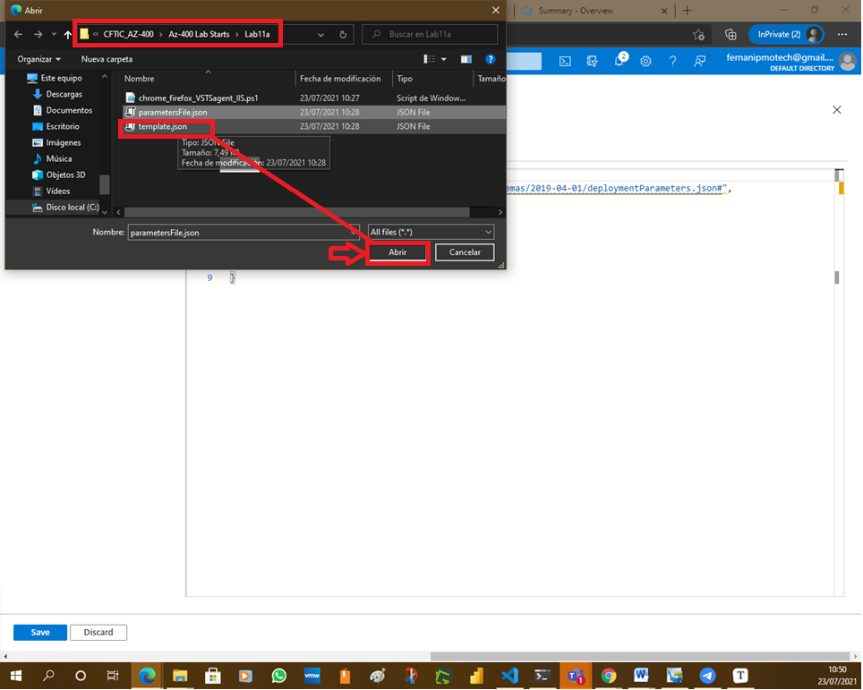
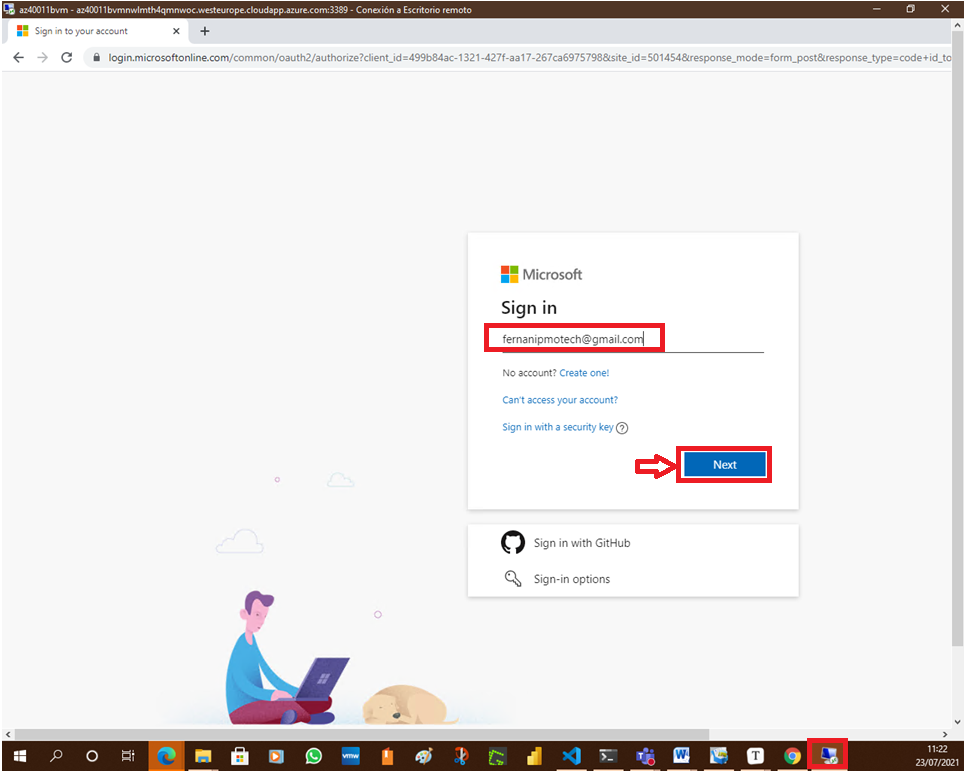

# Lab 11b: Setting Up and Running Functional Tests

# Student lab manual

## Lab overview

[Selenium](http://www.seleniumhq.org/) is a portable open source software-testing framework for web applications. It has the capability to operate on almost every operating system. It supports all modern browsers and multiple languages including .NET (C#), Java.

In this lab, you will learn how to execute Selenium test cases on a C# web application, as part of the Azure DevOps Release pipeline.

## Objectives

After you complete this lab, you will be able to:

- Configure a self-hosted Azure DevOps agent
- Configure release pipeline
- Trigger build and release
- Run tests in Chrome and Firefox

## Lab duration

- Estimated time: **60 minutes**

## Instructions

### Before you start

#### Sign in to the lab virtual machine

Ensure that you’re signed in to your Windows 10 virtual machine by using the following credentials:

- Username: **Student**
- Password: **Pa55w.rd**

#### Review applications required for this lab

Identify the applications that you’ll use in this lab:

- Microsoft Edge

#### Set up an Azure DevOps organization.

If you don’t already have an Azure DevOps organization that you can use for this lab, create one by following the instructions available at [Create an organization or project collection](https://docs.microsoft.com/en-us/azure/devops/organizations/accounts/create-organization?view=azure-devops).

#### Prepare an Azure subscription

- Identify an existing Azure subscription or create a new one.

- Verify that you have a Microsoft account or an Azure AD account with the Owner role in the Azure subscription and the Global Administrator role in the Azure AD tenant associated with the Azure subscription. For details, refer to [List Azure role assignments using the Azure portal](https://docs.microsoft.com/en-us/azure/role-based-access-control/role-assignments-list-portal) and [View and assign administrator roles in Azure Active Directory](https://docs.microsoft.com/en-us/azure/active-directory/roles/manage-roles-portal#view-my-roles).

  

### Exercise 0: Configure the lab prerequisites

In this exercise, you will set up the prerequisites for the lab, which include the preconfigured Parts Unlimited team project based on an Azure DevOps Demo Generator template and Azure resources.

#### Task 1: Configure the team project

In this task, you will use Azure DevOps Demo Generator to generate a new project based on the **Selenium** template.

1. On your lab computer, start a web browser and navigate to [Azure DevOps Demo Generator](https://azuredevopsdemogenerator.azurewebsites.net/). This utility site will automate the process of creating a new Azure DevOps project within your account that is prepopulated with content (work items, repos, etc.) required for the lab.

   > **Note**: For more information on the site, see [What is the Azure DevOps Services Demo Generator?](https://docs.microsoft.com/en-us/azure/devops/demo-gen).

2. Click **Sign in** and sign in using the Microsoft account associated with your Azure DevOps subscription.

   

3. If required, on the **Azure DevOps Demo Generator** page, click **Accept** to accept the permission requests for accessing your Azure DevOps subscription.

4. On the **Create New Project** page, in the **New Project Name** textbox, type **Setting Up and Running Functional Tests**, in the **Select organization** dropdown list, select your Azure DevOps organization, and then click **Choose template**.

   

5. In the list of templates, in the toolbar, click **DevOps Labs**, select the **Selenium** template and click **Select Template**.

   

6. Back on the **Create New Project** page, click **Create Project**

   

   

   > **Note**: Wait for the process to complete. This should take about 2 minutes. In case the process fails, navigate to your DevOps organization, delete the project, and try again.

7. On the **Create New Project** page, click **Navigate to project**.

   

   

#### Task 2: Create Azure resources

In this task, you will provision an Azure VM running Windows Server 2016 along with SQL Express 2017, Chrome, and Firefox.

1. Click on the deploy to Azure button below. [](http://azuredeploy.net/deploybutton.png). This will automatically redirect you to the **Custom deployment** blade in the Azure portal.

   

   

2. If prompted, sign in with the user account that has the Owner role in the Azure subscription you will be using in this lab and has the role of the Global Administrator in the Azure AD tenant associated with this subscription.

3. On the **Custom deployment** blade, specify the following settings:

   

   

   

   

   

   | Setting              | Value                                                        |
   | :------------------- | :----------------------------------------------------------- |
   | Subscription         | the name of the Azure subscription you are using in this lab |
   | Resource group       | the name of a new resource group **az400m11l02-RG**          |
   | Region               | the name of the Azure region in which you want to deploy the Azure resources in this lab |
   | Virtual Machine Name | **az40011bvm**                                               |

4. Click **Review + create** and then click **Create**.

   

   

   

   

   > **Note**: Wait for the process to complete. This should take about 15 minutes.


### Exercise 1: Implement Selenium tests by using a self-hosted Azure DevOps agent

In this exercise, you will implement Selenium tests by using a self-hosted Azure DevOps agent.

#### Task 1: Configure a self-hosted Azure DevOps agent

In this task, you will configure a self-hosted agent by using the VM you deployed in the previous exercise. Selenium requires the agent to be run in the interactive mode to execute the UI tests.

1. In the web browser window displaying the Azure portal, search for and select **Virtual machines** and, from the **Virtual machines** blade, select **az40011bvm**.

   

2. On the **az40011bvm** blade, select **Connect**, in the drop-down menu, select **RDP**, on the **RDP** tab of the **az40011bvm | Connect** blade, select **Download RDP File** and open the downloaded file.

   

   

   

3. When prompted, sign in with the following credentials:

   | Setting   | Value            |
   | :-------- | :--------------- |
   | User Name | **vmadmin**      |
   | Password  | **P2ssw0rd@123** |

   

   ![LAB11b-Az

   

4. Within the Remote Desktop session to **az40011bvm**, open a Chrome web browser window, navigate to **https://dev.azure.com** and sign in to your Azure DevOps organization.

   

   

   

   

   

   

   

   

   

   

   

   

5. In the lower left corner of the **Azure DevOps** portal, click **Organization settings**.

   

6. In the vertical menu on the left hand side of the page, in the **Pipelines** section, click **Agent pools**.

7. On the **Agent pools** pane, click **Default**.

   

8. On the **Default** pane, click **New agent**.

   

9. On the **Get the agent** panel, ensure that the **Windows** tab and the **x64** section are selected and then click **Download**.

   

10. Start File Explorer, create a directory **C:\AzAgent** and extract content of the downloaded agent zip file residing in the **Downloads** folder into this directory.

    

    

    

    

    

    

    

11. Within the Remote Desktop session to **az40011bvm**, right-click the **Start** menu and click **Command Prompt (Admin)**.

    

    

12. Within the **Administrator: Command Prompt** window, run the following to start the installation of the agent binaries:

    CodeCopy

    ```cmd
    cd C:\AzAgent
    Config.cmd
    ```

    

13. In the **Administrator: Command Prompt** window, when prompted to **Enter server URL**, type **https://dev.azure.com/ <your-DevOps-organization-name>**, where **<your-DevOps-organization-name>** represents the name of your Azure DevOps Organization, and press the **Enter** key.

14. In the **Administrator: Command Prompt** window, when prompted **Enter Authentication type (press enter for PAT)**, press the **Enter key**.

    

15. In the **Administrator: Command Prompt** window, when prompted **Enter personal access token**, switch to the Azure DevOps portal, close the **Get the agent** panel, in the upper right corner of the Azure DevOps page, click the **User settings** icon, in the dropdown menu, click **Personal access tokens**, on the **Personal Access Tokens** pane, and click **+ New Token**.

16. On the **Create a new personal access token** pane, specify the following settings and click **Create** (leave all others with their default values):

    | Setting | Value                                                   |
    | :------ | :------------------------------------------------------ |
    | Name    | **Setting Up and Running Functional Tests lab**         |
    | Scopes  | **Custom Defined**                                      |
    | Scopes  | Click **Show all scopes** (at the bottom of the window) |
    | Scopes  | **Agent Pools** - **Read & Manage**                     |

    

    

    

17. On the **Success** pane, copy the value of the personal access token to Clipboard.

    

    > **Note**: Make sure you copy the token. You will not be able to retrieve it once you close this pane.

18. On the **Success** pane, click **Close**.

    

19. Switch back to the **Administrator: Command Prompt** window and paste the content of Clipboard and press the **Enter key**.

20. In the **Administrator: Command Prompt** window, when prompted **Enter agent pool (press enter for default)**, press the **Enter key**.

21. In the **Administrator: Command Prompt** window, when prompted **Enter agent name (press enter for az40011bvm)**, press the **Enter key**.

22. In the **Administrator: Command Prompt** window, when prompted **Enter work folder (press enter for _work)**, press the **Enter key**.

23. In the **Administrator: Command Prompt** window, when prompted **Enter Perform an uszip for tasks for each step (press enter for N)**, press the **Enter key**.

24. In the **Administrator: Command Prompt** window, when prompted **Enter run agent as service (Y/N) (press enter for N)**, press the **Enter key**.

25. In the **Administrator: Command Prompt** window, when prompted **Enter configure autologon and run agent on startup (Y/N) (press enter for N)**, press the **Enter key**.

    

    

26. Once the agent is registered, in the **Administrator: Command Prompt** window, type **run.cmd** and press the **Enter** to start the agent.

    

    > **Note**: You also need to install the Dac Framework which is used by the application you will be deploying later in the lab.

27. Within the Remote Desktop session to **az40011bvm**, start a web browser, navigate to the [Microsoft SQL Server Data-Tier Application Framework (18.2) download page](https://www.microsoft.com/en-us/download/details.aspx?id=58207&WT.mc_id=rss_alldownloads_extensions). This will automatically trigger the download.

    

    

    

    

28. Once the download of the **DacFramework.msi** file completes, use it to run the installation of the Microsoft SQL Server Data-Tier Application Framework with the default settings.

    

    

    

    

    

    

    

    

    

#### Task 2: Configure a release pipeline

In this task, you will configure the release pipeline.

> **Note**: The Azure VM has the agent configured to deploy the applications and run Selenium testcases. The release definition uses **[Phases](https://docs.microsoft.com/en-us/vsts/build-release/concepts/process/phases)** to deploy to target servers.

1. Within the Remote Desktop session to **az40011bvm**, in the browser window displaying the **Azure DevOps** portal, click the **Azure DevOps** symbol in the upper left corner.

2. On the pane displaying your organization projects, click the tile representing the **Setting Up and Running Functional Tests** project.

3. On the **Setting Up and Running Functional Tests** pane, in the vertical navigational pane, select **Pipelines**, within the **Pipelines** section, click **Releases** and then, on the **Selenium** pane, click **Edit**.

   

4. On the **All pipelines > Selenium** pane, click the **Tasks** tab header and, in the dropdown menu, click **Dev**.

   

5. Within the list of tasks of the **Dev** stage, review the **IIS Deployment**, **SQL Deployment**, and **Selenium test execution** deployment phases.

- **IIS Deployment phase**: In this phase, we deploy application to the VM using the following tasks:
  - **IIS Web App Manage**: This task runs on the target machine where we registered agent. It creates a *website* and an *Application Pool* locally with the name **PartsUnlimited** running under the port **82** , [**http://localhost:82**](http://localhost:82/)
  - **IIS Web App Deploy**: This task deploys the application to the IIS server using **Web Deploy**.
- **Database deploy phase**: In this phase, we use [**SQL Server Database Deploy**](https://github.com/Microsoft/vsts-tasks/blob/master/Tasks/SqlDacpacDeploymentOnMachineGroup/README.md) task to deploy [**dacpac**](https://docs.microsoft.com/en-us/sql/relational-databases/data-tier-applications/data-tier-applications) file to the DB server.
- **Selenium tests execution**: Executing **UI testing** as part of the release process allows us to detect unexpected changes. Setting up automated browser based testing drives quality in your application, without having to do it manually. In this phase, we will execute Selenium tests on the deployed web application. The subsequent tasks describe using Selenium to test the websites in the release pipeline.
  - **Visual Studio Test Platform Installer**: The [Visual Studio Test Platform Installer](https://docs.microsoft.com/en-us/azure/devops/pipelines/tasks/tool/vstest-platform-tool-installer?view=vsts) task will acquire the Microsoft test platform from nuget.org or a specified feed, and add it to the tools cache. It satisfies the **vstest** requirements so any subsequent Visual Studio Test task in a build or release pipeline can run without needing a full Visual Studio install on the agent machine.
  - **Run Selenium UI tests**: This [task](https://github.com/Microsoft/azure-pipelines-tasks/blob/master/Tasks/VsTestV2/README.md) uses **vstest.console.exe** to execute the selenium testcases on the agent machines.

1. On the **All pipelines > Selenium** pane, click the **IIS Deployment** phase and, on the **Agent job** pane, verify that the **Default** Agent pool is selected.

   

   

   

   

2. Repeat the previous step for **SQL Deployment** and the **Selenium tests execution** phases. If needed, click **Save** to save the changes.

   

   

   

   

   

#### Task 3: Trigger Build and Release

In this task, we will trigger the **Build** to compile Selenium C# scripts along with the Web application. The resulting binaries are copied to self-hosted agent and the Selenium scripts are executed as part of the automated **Release**.

1. Within the Remote Desktop session to **az40011bvm**, in the browser window displaying the **Azure DevOps** portal, in the vertical navigational pane, in the **Pipelines** section, click **Pipelines** and then, on the **Pipelines** pane, click **Selenium**.

2. On the **Selenium** pane, click **Run pipeline** and, on the **Run pipeline**, click **Run**.

   

   

   > **Note**: This build will publish the test artifacts to Azure DevOps, which will be used in release.

   > **Note**: Once the build is successful, release will be triggered.

3. On the pipeline runs pane, in the **Jobs** section, click **Phase 1** and monitor the build progress until its completion.

   

   

   

   

   

   

   

4. In the browser window displaying the **Azure DevOps** portal, in the vertical navigational pane, in the **Pipelines** section, click **Releases**, click the entry representing the release, and, on the **Selenium > Release-1** pane, click **Dev**.

   

   

   

   

   

   

5. On the **Selenium > Release-1 > Dev** pane, monitor the corresponding deployment.

   

   

   

   

   

   

   

   

   

   

   

   

6. Once the **Selenium test execution** phase starts, monitor the web browser tests.

7. Once the release completes, on the **Selenium > Release-1 > Dev** pane, click on the **Tests** tab to analyze the test results. Select the required filters from the dropdown in **Outcome** section to view the tests and their status.

### Exercise 2: Remove the Azure lab resources

In this exercise, you will remove the Azure resources provisione in this lab to eliminate unexpected charges.

> **Note**: Remember to remove any newly created Azure resources that you no longer use. Removing unused resources ensures you will not see unexpected charges.

#### Task 1: Remove the Azure lab resources

In this task, you will use Azure Cloud Shell to remove the Azure resources provisioned in this lab to eliminate unnecessary charges.

1. In the Azure portal, open the **Bash** shell session within the **Cloud Shell** pane.

2. List all resource groups created throughout the labs of this module by running the following command:

   ShellCopy

   ```sh
   az group list --query "[?starts_with(name,'az400m11l02-RG')].name" --output tsv
   ```

3. Delete all resource groups you created throughout the labs of this module by running the following command:

   ShellCopy

   ```sh
   az group list --query "[?starts_with(name,'az400m11l02-RG')].[name]" --output tsv | xargs -L1 bash -c 'az group delete --name $0 --no-wait --yes'
   ```

   > **Note**: The command executes asynchronously (as determined by the –nowait parameter), so while you will be able to run another Azure CLI command immediately afterwards within the same Bash session, it will take a few minutes before the resource groups are actually removed.

## Review

In this lab, you learned how to execute Selenium test cases on a C# web application, as part of the Azure DevOps Release pipeline.