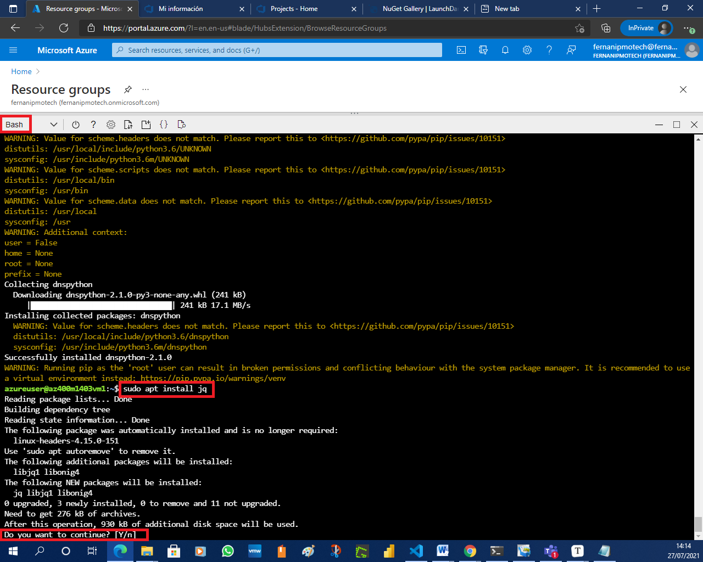
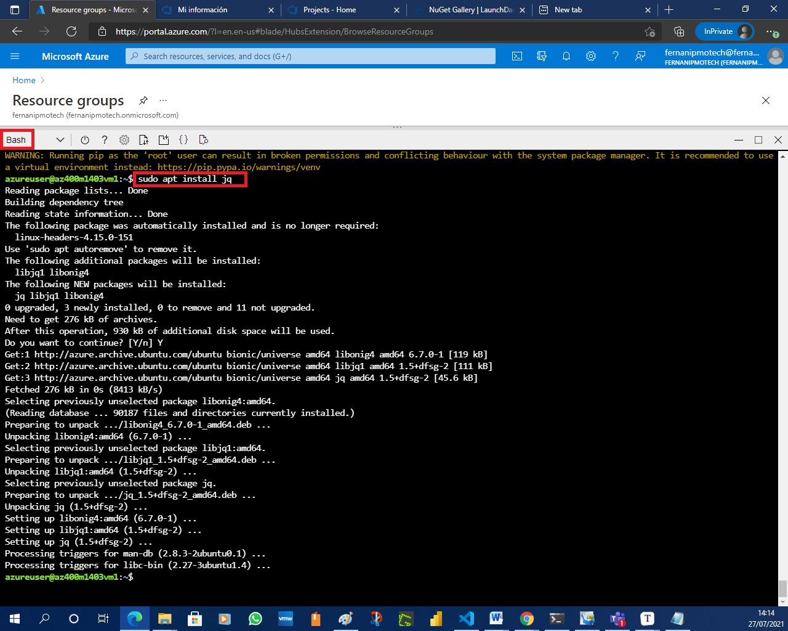
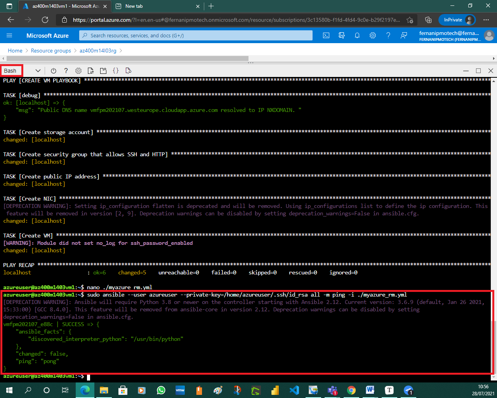
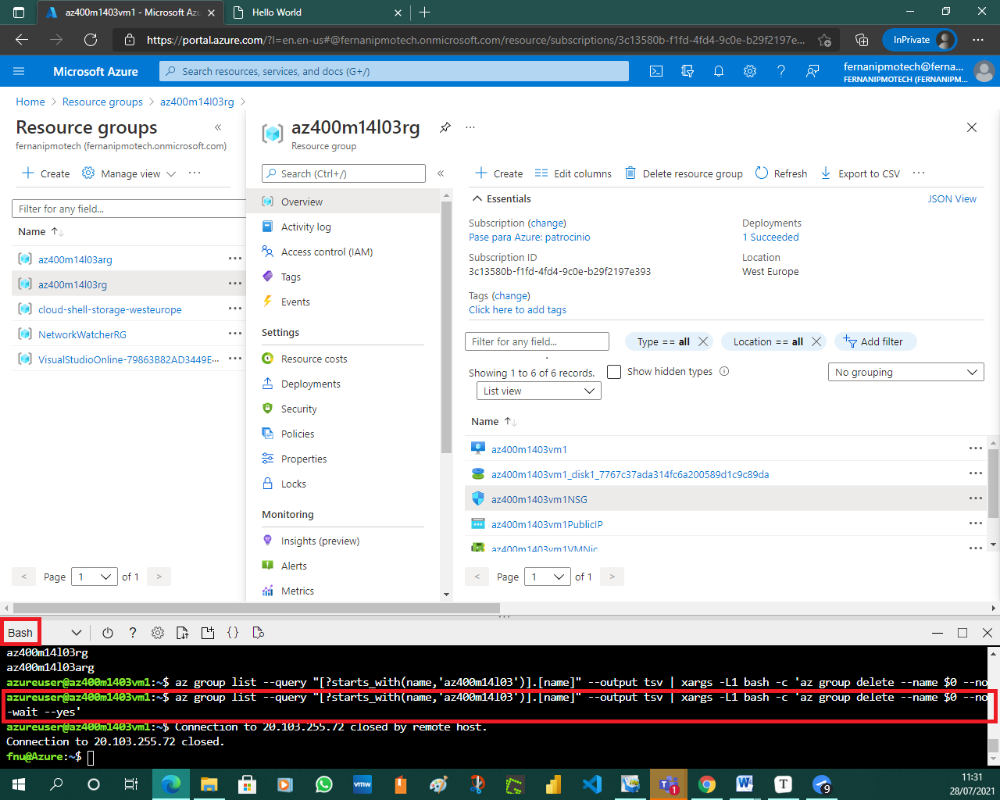
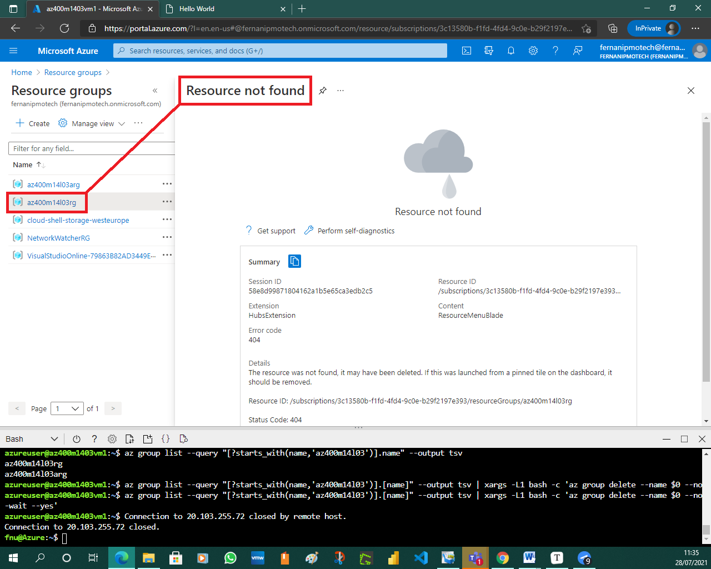
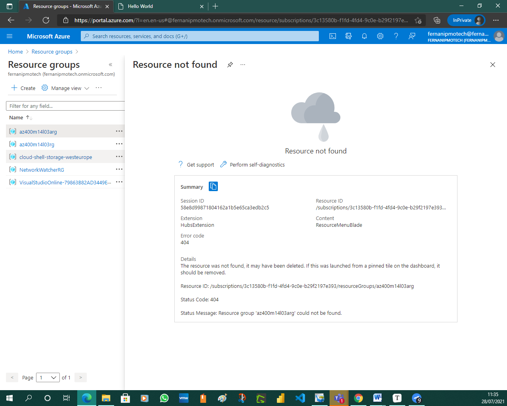

# Lab 14a: Ansible with Azure

# Student lab manual

## Lab overview

In this lab we will deploy, configure, and manage Azure resources by using Ansible.

Ansible is declarative configuration management software. It relies on a description of the intended configuration applicable to managed computers in the form of playbooks. Ansible automatically applies that configuration and maintains it going forward, addressing any potential discrepancies. Playbooks are formatted by using YAML.

Unlike the majority of other configuration management tools, such as Puppet or Chef, Ansible is agentless, which means that it does not require the installation of any software in the managed machines. Ansible uses SSH to manage Linux servers and Powershell Remoting to manage Windows servers and clients.

In order to interact with resources other than operating systems (such as, for example, Azure resources accessible via Azure Resource Manager), Ansible supports extensions called modules. Ansible is written in Python so, effectively, the modules are implemented as Python libraries. In order to manage Azure resources, Ansible relies on [GitHub-hosted modules](https://github.com/ansible-collections/azure).

Ansible requires that the managed resources are specified in a designated host inventory. Ansible supports dynamic inventories for some systems, including Azure, so that the host inventory is dynamically generated at runtime.

The lab will consist of the following high-level steps:

- Installing and configuring Ansible on the Azure VM
- Downloading Ansible configuration and sample playbook files
- Creating and configuring a managed identity in Azure AD
- Configuring Azure AD credentials and SSH for use with Ansible
- Deploying an Azure VM by using an Ansible playbook
- Configuring an Azure VM by using an Ansible playbook

## Objectives

After you complete this lab, you will be able to:

- Install and configure Ansible on Azure VM
- Download Ansible configuration and sample playbook files
- Create and configure Azure Active Directory managed identity
- Configure Azure AD credentials and SSH for use with Ansible
- Deploy an Azure VM by using an Ansible playbook
- Configure an Azure VM by using an Ansible playbook

## Lab duration

- Estimated time: **90 minutes**

## Instructions

### Before you start

#### Sign in to the lab virtual machine

Ensure that you’re signed in to your Windows 10 computer by using the following credentials:

- Username: **Student**
- Password: **Pa55w.rd**

#### Review applications required for this lab

Identify the applications that you’ll use in this lab:

- Microsoft Edge

#### Prepare an Azure subscription

- Identify an existing Azure subscription or create a new one.
- Verify that you have a Microsoft account or an Azure AD account with the Owner role in the Azure subscription and the Global Administrator role in the Azure AD tenant associated with the Azure subscription. For details, refer to [List Azure role assignments using the Azure portal](https://docs.microsoft.com/en-us/azure/role-based-access-control/role-assignments-list-portal) and [View and assign administrator roles in Azure Active Directory](https://docs.microsoft.com/en-us/azure/active-directory/roles/manage-roles-portal#view-my-roles).


### Exercise 1: Deploy, configure, and manage Azure VMs by using Ansible

In this exercise, you will deploy, configure, and manage Azure VMs by using Ansible.

#### Task 1: Provision an Azure VM serving as the Ansible control node

In this task, you will deploy an Azure VM by using Azure CLI and configure it as an Ansible control node that manages your Ansible environment.

> **Note**: You will use the Azure VM configured as an Ansible control node to perform Ansible management tasks, including those you performed in the previous tasks of this lab.

1. In the Azure portal, in the toolbar, click the **Cloud Shell** icon located directly to the right of the search text box.

   

   

   

   > **Note**: Alternatively, you can access Cloud Shell directly by navigating to [https://shell.azure.com](https://shell.azure.com/).

2. If prompted to select either **Bash** or **PowerShell**, select **Bash**.

   > **Note**: If this is the first time you are starting **Cloud Shell** and you are presented with the **You have no storage mounted** message, select the subscription you are using in this lab, and select **Create storage**.

   

   

3. From the Bash session in the Cloud Shell pane, run the following to specify the name of the Azure region that will host the resources you deploy in this lab (replace the `<Azure_region>` placeholder with the name of the Azure region where you intend to deploy resources. Make sure that the name does not contain any spaces, e.g. `westeurope`):

   CodeCopy

   ```bash
   LOCATION=<Azure_region>
   ```

   

4. From the Bash session in the Cloud Shell pane, run the following to create resource groups that will host the Azure VMs you deploy in this lab:

   CodeCopy

   ```bash
   RG1NAME=az400m14l03rg
   az group create --name $RG1NAME --location $LOCATION
   RG2NAME=az400m14l03arg
   az group create --name $RG2NAME --location $LOCATION
   ```

   

5. Run the following to deploy an Azure VM running Ubuntu into the resource group you created in the previous step:

   CodeCopy

   ```bash
   VM1NAME=az400m1403vm1
   az vm create \
   --resource-group $RG1NAME \
   --name $VM1NAME \
   --image UbuntuLTS \
   --authentication-type password \
   --admin-username azureuser \
   --admin-password Pa55w.rd1234
   ```

   > **Note**: Wait for the deployment to complete before you proceed to the next step. This might take about 2 minutes.

   > **Note**: Once the provisioning completes, in the JSON-based output, identify the value of the **“publicIpAddress”** property included in the output.

   

6. Run the following to connect to the newly deployed Azure VM by using SSH:

   CodeCopy

   ```bash
   PIP=$(az vm show --show-details --resource-group $RG1NAME --name $VM1NAME --query publicIps --output tsv)
   ssh azureuser@$PIP
   ```

   

7. When prompted for confirmation to proceed, type **yes** and press the **Enter** key and, when prompted to provide the password, type **Pa55w.rd1234**.

   

#### Task 2: Install and configure Ansible on an Azure VM

In this task, you will install and configure Ansible on the Azure VM you deployed in the previous task.

1. In the Bash session in the Cloud Shell pane, within the SSH session to the newly deployed Azure VM, run the following to update the Advanced Packaging Tool (apt) package list to include the latest version and package details:

   CodeCopy

   ```bash
   sudo apt-get update
   ```

   

   

2. Run the following to install Ansible and the required Azure modules (**make sure that you run the commands individually, line by line**, and, whenever you are prompted for confirmation, type **y** and press the **Enter** key):

   CodeCopy

   ```bash
   sudo apt install python3-pip
   sudo -H pip3 install --upgrade pip
   sudo -H pip3 install ansible[azure]
   sudo apt-add-repository --yes --update ppa:ansible/ansible
   sudo apt install ansible
   sudo ansible-galaxy collection install azure.azcollection
   curl -O https://raw.githubusercontent.com/ansible-collections/azure/dev/requirements-azure.txt
   sudo pip3 install -r requirements-azure.txt
   rm requirements-azure.txt
   ```

   > **Note**: Disregard any warnings. If you encounter any errors, rerun the commands.

   

   

   

   

   

   

   

   

   

   

   

   

   

   

   

3. Run the following to install the dnspython package to allow the Ansible playbooks to verify DNS names before deployment:

   CodeCopy

   ```bash
   sudo -H pip3 install dnspython
   ```

   

4. In the Bash session in the Cloud Shell pane, within the SSH session to the newly deployed Azure VM, run the following to install the **jq** JSON parsing tool (when prompted, type **y** and press the **Enter** key):

   CodeCopy

   ```bash
   sudo apt install jq
   ```

   

   

5. Run the following to install Azure CLI:

   CodeCopy

   ```bash
   curl -sL https://aka.ms/InstallAzureCLIDeb | sudo bash
   ```


#### Task 3: Download Ansible configuration and sample playbook files

In this task, you will download from GitHub the Ansible configuration repository along with the sample lab files.

1. In the Bash session in the Cloud Shell pane, within the SSH session to the newly deployed Azure VM, run the following to ensure that **git** is installed:

   CodeCopy

   ```bash
   sudo apt install git
   ```

   

2. Run the following to clone the PartsUnlimitedMRP repo from GitHub:

   CodeCopy

   ```bash
   git clone https://github.com/Microsoft/PartsUnlimitedMRP.git
   ```

   > **Note**: This repository contains playbooks for creating a wide range of resources, some of which we will use in the lab.


#### Task 4: Create and configure Azure Active Directory managed identity

In this task, you will generate an Azure AD managed identity in order to facilitate non-interactive authentication of Ansible, which is necessary to access Azure resources. You will also assign to the managed identity the Contributor role on the resource group you created in the previous task.

1. In the Bash session in the Cloud Shell pane, within the SSH session to the newly deployed Azure VM, run the following to sign in to the Azure AD tenant associated with your Azure subscription:

   CodeCopy

   ```bash
   az login
   ```

   > **Note**: If the command fails, rerun the installation of Azure CLI.

   

2. Note the code displayed in the output of the previous command and switch to your lab computer. From your lab computer, open another tab in the browser window displaying the Azure portal, navigate to [the Microsoft Device Login page](https://microsoft.com/devicelogin) and, when prompted, enter the code and select **Next**.

   

3. When prompted, sign in with credentials you are using in this lab and close the browser tab.

   

   

   

4. Switch back to the Bash session in the Cloud Shell pane. Within the SSH session to the Azure VM configured as the Ansible control node, run the following to generate a system assigned managed identity:

   CodeCopy

   ```bash
   RG1NAME=az400m14l03rg
   VM1NAME=az400m1403vm1
   az vm identity assign --resource-group $RG1NAME --name $VM1NAME
   ```

   

5. Run the following to identify the value of your subscription by running:

   CodeCopy

   ```bash
   SUBSCRIPTIONID=$(az account show --query id --output tsv)
   ```

   

6. Run the following to retrieve the value of the **ID** property of the built-in Azure Role Based Access Control Contributor role:

   CodeCopy

   ```bash
   CONTRIBUTORID=$(az role definition list --name "Contributor" --query "[].id" --output tsv)
   ```

   

7. Run the following to assign the Contributor role on the resource group you created earlier in this lab:

   CodeCopy

   ```bash
   MIID=$(az resource list --name $VM1NAME --query [*].identity.principalId --out tsv)
   
   RG2NAME=az400m14l03arg
   az role assignment create --assignee "$MIID" \
   --role "$CONTRIBUTORID" \
   --scope /subscriptions/$SUBSCRIPTIONID/resourceGroups/$RG2NAME
   ```


#### Task 5: Configure SSH for use with Ansible

In this task, you will configure SSH for use with Ansible.

1. In the Bash session in the Cloud Shell pane, within the SSH session to the newly deployed Azure VM, run the following to generate the key pair (when prompted, press the **Enter** key three times to accept the default values of the locations of the files and not to set the passphrase):

   CodeCopy

   ```bash
   ssh-keygen -t rsa
   ```

   

   

2. Run the following to grant read, write, and execute permissions on the **.ssh** folder hosting the private key:

   CodeCopy

   ```bash
   chmod 755 ~/.ssh
   ```

   

3. Run the following to create as well as set read and write permissions on the **authorized_keys** file.

   CodeCopy

   ```bash
   touch ~/.ssh/authorized_keys
   chmod 644 ~/.ssh/authorized_keys
   ```

   > **Note**: By providing keys included in this file, you are allowed access without having to provide a password.

   

4. Run the following to add the password to the **authorized_keys** file:

   CodeCopy

   ```bash
   ssh-copy-id azureuser@127.0.0.1
   ```

   

5. When prompted, type **yes** and enter the password **Pa55w.rd1234** for the **azureuser** user account you specified when deploying the third Azure VM earlier in this lab.

6. Run the following to verify that you are not prompted for password:

   CodeCopy

   ```bash
   ssh 127.0.0.1
   ```

   

7. Type **exit** and press the **Enter** key to terminate the loopback connection you just established.

   

> **Note**: Establishing passwordless SSH authentication is a critical step for setting up your Ansible environment.

#### Task 6: Create a web server Azure VM by using an Ansible playbook

In this task, you will create an Azure VM hosting a web server by using an Ansible playbook.

> **Note**: Now that we have Ansible up and running in the control Azure VM, we can deploy our first playbook in order to create and configure a managed Azure VM. Before deploying the sample playbook, you need to replace the public SSH key included in its content with the key you generated in the previous task.

1. In the Bash session in the Cloud Shell pane, within the SSH session to the Azure VM configured as the Ansible control node, run the following to identify the locally stored public key which you generated in the previous task:

   CodeCopy

   ```bash
   cat ~/.ssh/id_rsa.pub
   ```

   

2. Record the output, including the username at the end of the output string.

   

   

   

3. Run the following to open the **new_vm_web.yml** file in the Nano text editor:

   CodeCopy

   ```bash
   nano ~/PartsUnlimitedMRP/Labfiles/AZ-400T05-ImplemntgAppInfra/Labfiles/ansible/new_vm_web.yml
   ```

   

4. In the nano editor, if needed, change the name of the region in the `dnsname: '.westeurope.cloudapp.azure.com'` entry to the name of the Azure region you are targeting for deployment.

   > **Note**: Make sure that this region matches the Azure region where you created the **az400m14l03rg** resource group.

   

5. In the nano editor, change the value of `vm_size` entry from `Standard_A0` to `Standard_DS1_v2`.

   

   

6. In the nano editor, locate the SSH string towards the end of the file, in the `key_data` entry, delete the existing key value and replace it with the key value that you recorded earlier in this task.

   > **Note**: Make sure that the value of `admin_username` entry that is included in the file matches the user name you used to sign in to the Azure VM hosting the Ansible control system (**azureuser**). The same user name must be used in the `path` entry of `ssh_public_keys` section.

   

   

   

   

7. Within the Nano editor interface, press **ctrl + o** key combination, press the **Enter** key, and then press **ctrl + x** key combination to save the changes you made and close the file.

   

   > **Note**: Next, you will deploy an Azure VM into the resource group created at the beginning of the lab. Use the following values for the deployment:

   | Setting         | Value                 |
   | :-------------- | :-------------------- |
   | Resource group  | **az400m14l03arg**    |
   | Virtual network | **az400m1403aVNET**   |
   | Subnet          | **az400m1403aSubnet** |

   > **Note**: The variables can be defined inside of playbooks or can be entered at runtime when invoking the `ansible-playbook` command by including the `--extra-vars` option. As the VM name, use only up to 15 lower case letters and numbers (no hyphens, underscore signs or upper case letters) and ensure it is globally unique, since the same name is used to generate the storage account and the DNS name for the public IP address associated with the corresponding Azure VM.

8. Run the following to create the virtual network and its subnet into which you will deploy an Azure VM by using an ansible playbook:

   CodeCopy

   ```bash
   RG1NAME=az400m14l03arg
   LOCATION=$(az group show --resource-group $RG1NAME --query location --output tsv)
   RG2NAME=az400m14l03arg
   VNETNAME=az400m1403aVNET
   SUBNETNAME=az400m1403aSubnet
   az network vnet create \
   --name $VNETNAME \
   --resource-group $RG2NAME \
   --location $LOCATION \
   --address-prefixes 192.168.0.0/16 \
   --subnet-name $SUBNETNAME \
   --subnet-prefix 192.168.1.0/24
   ```

   

   

9. Run the following to deploy the sample ansible playbook that provisions an Azure VM (**make sure to replace the `<VM_name>` with the unique VM name you chose**):

   CodeCopy

   ```bash
   sudo ansible-playbook ~/PartsUnlimitedMRP/Labfiles/AZ-400T05-ImplemntgAppInfra/Labfiles/ansible/new_vm_web.yml --extra-vars "vmname=<VM_name> resgrp=az400m14l03arg vnet=az400m1403aVNET subnet=az400m1403aSubnet"
   ```

   > **Note**: Disregard deprecation warning regarding the setting ip_configuration.

   > **Note**: You might receive the following errors if you enter an existing or an invalid VM name:

   - `fatal: [localhost]: FAILED! => {"changed": false, "failed": true, "msg": "The storage account named storageaccountname is already taken. - Reason.already_exists"}`. To resolve this, use another name for the Azure VM, since the one you used is not globally unique.
   - `fatal: [localhost]: FAILED! => {"changed": false, "failed": true, "msg": "Error creating or updating your-vm-name - Azure Error: InvalidDomainNameLabel\nMessage: The domain name label for your VM is invalid. It must conform to the following regular expression: ^[a-z][a-z0-9-]{1,61}[a-z0-9]$.”}`. To resolve this issue, use another name for the Azure VM following the required naming convention.

   > **Note**: Wait for the deployment to complete. This might take about 3 minutes.

   

   

   

10. Run the following to create a new file named **myazure_rm.yml** and open it in the Nano text editor:

    CodeCopy

    ```bash
    nano ./myazure_rm.yml
    ```

    

11. Within the Nano editor interface, paste the following content:

    CodeCopy

    ```bash
    plugin: azure_rm
    include_vm_resource_groups:
    - az400m14l03arg
    auth_source: msi
    
    keyed_groups:
    - prefix: tag
      key: tags
    ```

    

12. Within the Nano editor interface, press **ctrl + o** key combination, press the **Enter** key, and then press **ctrl + x** key combination to save the changes you made and close the file.

    

    

13. Back in the Bash session in the Cloud Shell pane, within the SSH session to the Azure VM configured as the Ansible control node, run the following to perform a ping test, verifying that the dynamic inventory file includes the newly deployed Azure VM:

    CodeCopy

    ```bash
    sudo ansible --user azureuser --private-key=/home/azureuser/.ssh/id_rsa all -m ping -i ./myazure_rm.yml
    ```

    

    

14. When prompted whether you want to continue connecting, type **yes** and press the **Enter** key.

    > **Note**: The output should resemble the following:

    CodeCopy

    ```bash
    az400m1403vm2_5444 | SUCCESS => {
        "ansible_facts": {
            "discovered_interpreter_python": "/usr/bin/python"
        },
        "changed": false,
        "ping": "pong"
    }
    ```

    > **Note**: The first time you run the command you will have to acknowledge the authenticity of the target VMs, by typing **yes** and pressing the **Enter** key.



#### Task 7: Configure an Azure VM by using an Ansible playbook

In this task, you will run another Ansible playbook, this time to configure the newly deployed Azure VM. You will use a playbook that installs a software package httpd and downloads an HTML page from a GitHub repository. Once this is completed, you will have a fully functional Web server.

> **Note**: We will use the sample playbook **~/PartsUnlimitedMRP/Labfiles/AZ-400T05-ImplemntgAppInfra/Labfiles/ansible/httpd.yml**. We will use the variable **vmname** in order to modify the hosts parameter of the playbook that defines which host (out of the ones returned by the dynamic inventory script) the playbook will target.

1. In the Bash session in the Cloud Shell pane, within the SSH session to the Azure VM configured as the Ansible control node, run the following to identify the public IP address of the newly deployed Azure VM (**make sure to replace the `<VM_name>` placeholder with the name you assigned to the newly provisioned Azure VM**):

   CodeCopy

   ```bash
   RGNAME='az400m14l03arg'
   VMNAME='<VM_name>'
   PIP=$(az vm show --show-details --resource-group $RGNAME --name $VMNAME --query publicIps --output tsv)
   ```

   

2. Run the folowing to verify that the newly deployed Azure VM is currently not running any web service (where the `<IP_address>` placeholder represents the public IP address assigned to the network adapter of the Azure VM you provisioned in the previous task):

   CodeCopy

   ```bash
   curl http://$PIP
   ```

   > **Note**: Verify that the response is in the format `curl: (7) Failed to connect to 52.186.157.26 port 80: Connection refused`.

   

3. Run the following to install the HTTP service by using the Ansible playbook (where the `<VM_name>` placeholder represents the name of the VM you provisioned in the previous task):

   CodeCopy

   ```bash
   sudo ansible-playbook --user azureuser --private-key=/home/azureuser/.ssh/id_rsa -i ./myazure_rm.yml ~/PartsUnlimitedMRP/Labfiles/AZ-400T05-ImplemntgAppInfra/Labfiles/ansible/httpd.yml --extra-vars "vmname=<VM_name>*"
   ```

   > **Note**: Make sure to include the trailing asterisk (*****) following the Azure VM name.

   > **Note**: Wait for the installation to complete. This should take less than a minute.

   

   

4. Once the installation completes, run the following to verify that the newly deployed Azure VM is now running a web service (where the `<IP_address>` placeholder represents the public IP address assigned to the network adapter of the Azure VM you provisioned in the previous task):

   CodeCopy

   ```bash
   curl http://$PIP
   ```

   > **Note**: The output should have the following content:

   CodeCopy

   ```html
    <!DOCTYPE html>
    <html lang="en">
        <head>
            <meta charset="utf-8">
            <title>Hello World</title>
        </head>
        <body>
            <h1>Hello World</h1>
            <p>
                <br>This is a test page
                <br>This is a test page
                <br>This is a test page
            </p>
        </body>
    </html>
   ```


### Exercise 2: Remove the Azure lab resources

In this exercise, you will remove the Azure resources provisioned in this lab to eliminate unexpected charges.

> **Note**: Remember to remove any newly created Azure resources that you no longer use. Removing unused resources ensures you will not see unexpected charges.

#### Task 1: Remove the Azure lab resources

In this task, you will use Azure Cloud Shell to remove the Azure resources provisioned in this lab to eliminate unnecessary charges.

1. In the Azure portal, open the **Bash** shell session within the **Cloud Shell** pane.

2. List all resource groups created throughout the labs of this module by running the following command:

   ShellCopy

   ```sh
   az group list --query "[?starts_with(name,'az400m14l03')].name" --output tsv
   ```

   

3. Delete all resource groups you created throughout the labs of this module by running the following command:

   ShellCopy

   ```sh
   az group list --query "[?starts_with(name,'az400m14l03')].[name]" --output tsv | xargs -L1 bash -c 'az group delete --name $0 --no-wait --yes'
   ```

   > **Note**: The command executes asynchronously (as determined by the –nowait parameter), so while you will be able to run another Azure CLI command immediately afterwards within the same Bash session, it will take a few minutes before the resource groups are actually removed.








## Review


In this lab, you learned how to deploy, configure, and manage Azure resources by using Ansible.